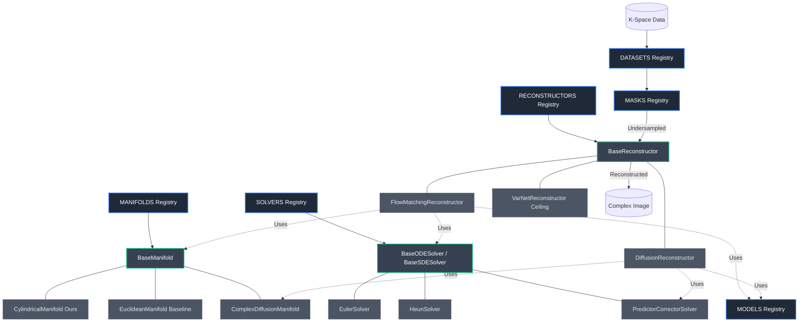

# Complex Flow Matching (CFM) for MRI Synthesis

[](LICENSE)
[](pyproject.toml)

A generative model for synthesizing MRI data using **Flow Matching** on cylindrical manifolds. This work applies continuous normalizing flows to complex-valued MRI images, representing them in amplitude-phase space.

## Motivation

MRI data has unique properties:
- **Complex-valued**: Both magnitude and phase contain clinical information
- **Cylindrical geometry**: Phase lives on a circle $[0, 2\pi)$, amplitude is non-negative

Standard generative models (VAE, diffusion) treat MRI as real-valued Euclidean data, losing these geometric properties. **Flow Matching on cylindrical manifolds** respects the true structure of MRI data, leading to more realistic synthesis.

## Method

### Cylindrical Representation
MRI data is transformed from complex domain to cylindrical coordinates:
```
z = r * e^(iφ)  →  [r, cos(φ), sin(φ)]
```

### Geodesic Flow Bridge
We construct a probability path from pure noise to real MRI data using shortest paths (geodesics) on the cylinder:
- **Amplitude**: Linear interpolation in [0,1]
- **Phase**: Geodesic (shortest angular distance) on the circle

### Training
- Model learns to match a **Continuous Normalizing Flow** to this probability path
- Loss: Decoupled cylindrical loss for amplitude and angular components
- Optimizer: Adam with learning rate scheduling
- Monitoring: Weights & Biases (W&B), opt-in via `logging=w_and_b`

### Generation (Inference)
- Sample random noise in cylindrical space
- Solve ODE from t=0 to t=1 using trained Flow
- Convert back to complex domain and visualize magnitude/phase

### The Euclidean baseline

To know how much the cylindrical geometry actually buys, the repo ships a
**flat R^2 baseline** that runs through the *same* pipeline. Complex pixels are
carried as `[Re z, Im z]`, the bridge is the straight line
`x_t = (1-t)x_0 + t*x_1` with `u = x_1 - x_0`, the loss is a plain L1 over both
channels, and the ODE step is `x <- x + v*dt` with **no phase wrapping, no modulo
arithmetic and no re-projection of any kind**.

Only seven things differ between the two arms - representation, prior, bridge,
loss, solver step, back-transform, and the 2.5D window pipeline. The dataset, the U-Net trunk, the optimizer,
the Heun schedule, the metrics and the checkpoint plumbing are literally shared
code, so a gap in the results can only come from the geometry.

```bash
uv run src/cfm/train.py manifold=euclidean logging.experiment_name=my_baseline
```

## Project Structure

```text
src/cfm/
├── train.py              # Generative (ODE/SDE) training entry point
├── generate.py           # Generation from pure noise
├── evaluate.py           # Evaluation pipeline (PSNR/SSIM)
├── suite.py              # Mission control CLI (matrix training, sweeps, Slurm dispatch, eval)
├── core/
│   ├── registry.py       # Base Registry system (MODELS, MANIFOLDS, etc.)
│   ├── manifold.py       # BaseManifold interface
│   ├── reconstructor.py  # BaseReconstructor interface & FlowMatchingReconstructor
│   ├── solver.py         # BaseODESolver and BaseSDESolver interfaces
│   └── dataset.py        # BaseComplexDataset interface
├── manifolds/
│   ├── cylindrical.py    # R^+ x S^1 - Cylindrical Flow Matching (Ours)
│   ├── euclidean.py      # Flat R^2 - Standard Flow Matching Baseline
│   └── complex_diffusion.py # Variance-Exploding SDE Baseline
├── models/
│   ├── cylindrical_unet.py              # Main U-Net trunk
│   ├── cylindrical_unet_attention.py    # Self-attention variant
│   ├── cylindrical_unet_cross_slice.py  # 2.5D cross-slice attention
│   └── varnet.py                        # fastMRI VarNet Reconstructor (Ceiling)
├── solvers/
│   └── diffusion_solver.py  # Predictor-Corrector (Euler-Maruyama + Langevin)
├── flow/
│   ├── solver.py            # Heun / Euler ODE Solvers
│   └── torus_math.py        # Geodesic metrics and mappings
├── data/
│   ├── dataset.py        # SKM-TEA dataset loader
│   ├── fastmri.py        # fastMRI dataset loader (multi-coil)
│   ├── masks.py          # Cartesian 1D & Poisson-Disc 2D mask generators
│   ├── transforms.py     # CenterCropOrPad, Modulus normalization
│   └── hdf5_manager.py   # Safe multi-worker file handle manager
└── utils/
    ├── complex_ops.py    # Complex <-> cylindrical / euclidean
    ├── inference.py      # Registry-driven model/manifold building
    ├── distributed.py    # DDP process group, rank helpers, wrapper unwrapping
    ├── checkpoint.py     # Atomic resume state (weights + optimizer + schedule)
    └── metrics.py        # PSNR, SSIM, Circular Phase Error

conf/                     # Hydra configurations
├── config.yaml           # Main config
├── manifold/             # cylindrical, euclidean, complex_diffusion
├── model/                # c_unet, varnet, etc.
├── dataset/              # skm_tea, fastmri_local
├── reconstructor/        # varnet
└── evaluate/             # Evaluation integration settings

scripts/
├── launch_slurm.sh       # PLGrid A100 submit wrapper (dry-runs by default)
└── slurm/
    ├── train_ddp.sbatch              # Multi-GPU job: torchrun + requeue on preempt
    ├── bootstrap_plgrid_storage.sh   # Group-storage tree + project-scoped symlinks
    └── train_*.sbatch                # Single-GPU jobs, one per geometry

docs/plgrid/             # PLGrid runbook, vendor-neutral (see "Multi-GPU" below)
├── SKILL.md              # Entry point: routing + operating rules
├── INSTALL.md            # Wiring it into Claude Code / Codex / Cursor / Copilot
└── references/           # Setup, running experiments, CFM-on-Athena specifics

outputs/
├── train/{experiment_name}/{date}_{time}/
│   ├── checkpoints/      # Model weights (.pt), for generate/evaluate
│   └── wandb/            # W&B logs
├── state/{experiment_name}/
│   └── last.pt           # Resume state; stable path, survives a requeue
├── generate/{experiment_name}/{date}_{time}/
│   └── *.png             # Generated images
└── evaluate/{experiment_name}/{date}_{time}/
    └── metrics.json      # Scored metrics

schedule_runs.sh         # Batch training script (HF sweep)
schedule_comparison.sh   # Trains + scores both geometries for Table 1
```

## Quick Start

### Environment Setup
```bash
git clone https://github.com/Marcelele-0/Complex-Flow-Matching.git
cd Complex-Flow-Matching

uv sync                    # Install dependencies
export WANDB_API_KEY=...   # Only needed if you run with logging=w_and_b
```

### Data

Place your dataset under `data/` (e.g. `data/skm-tea-mini/v1-release`) and point `conf/dataset/skm_tea.yaml` at the correct path. The `data/` directory is git-ignored, so datasets are never committed to the repo.

### Training

**Single run:**
```bash
uv run src/cfm/train.py
```

**Custom experiment:**
```bash
uv run src/cfm/train.py training.loss.lambda_phase=2.0 logging.experiment_name=my_run
```

**Batch schedule:**
```bash
./schedule_runs.sh
```
Edit the script to customize experiment parameters.

**2.5D cross-slice model:**

`c_unet_cross_slice` runs a shared 2D encoder over a window of neighbouring slices,
fuses them with attention at the bottleneck, and decodes the **center slice only**.
It buys volumetric consistency without a full 3D U-Net.

```bash
uv run src/cfm/train.py model=c_unet_cross_slice dataset.num_slices=3
```

`dataset.num_slices` must be odd and greater than 1 for this model; the 2D models
require `num_slices=1`. Training fails immediately on a mismatch rather than
crashing later inside a convolution.

It runs on **either geometry** — the input width follows `manifold.state_channels`
exactly as the 2D trunks do, so the 2.5D row of a comparison has both arms:

```bash
uv run src/cfm/train.py model=c_unet_cross_slice dataset.num_slices=3 manifold=euclidean
```

Normalisation moves behind the stack for slice windows (one peak per window, not
per slice, so inter-slice brightness survives); each manifold supplies that pair
through `build_window_transforms`.

> **Sampling is not wired yet.** The model emits a center-only velocity, which the
> ODE solver cannot use to advance a multi-slice state, so `generate.py` and
> `evaluate.py` raise `NotImplementedError` for it. Use the 2D models to sample.
>
> **Memory:** the encoder runs on `batch_size × num_slices` images, so expect to
> roughly halve `batch_size` versus `c_unet_attention` at `num_slices=3`. Measure
> rather than assume — the bottleneck is actually cheaper here.

### Multi-GPU training (DDP)

`train.py` is one program at every scale. Under `torchrun` it wraps the model in
`DistributedDataParallel`, shards the split with a `DistributedSampler` and reduces
epoch metrics across ranks; without it `world_size` is 1, no process group exists
and the same statements run unchanged.

```bash
uv run torchrun --standalone --nproc-per-node=4 src/cfm/train.py manifold=cylindrical
```

> **`training.batch_size` is per GPU.** The effective batch is
> `batch_size × world_size` and the learning rate is **not** rescaled, so a 4-GPU run
> at the default `batch_size=4` trains on batches of 16. Adjust one of the two before
> putting the numbers next to a single-GPU run.

Only rank 0 prints, checkpoints and logs to W&B. Checkpoints are written from the
unwrapped module, so a checkpoint from an eight-GPU compiled run loads into
`generate.py` and `evaluate.py` unchanged.

#### On PLGrid (Athena, `plgrid-gpu-a100`)

```bash
export PLG_GROUP=<group from hpc-fs>          # once per session
./scripts/slurm/bootstrap_plgrid_storage.sh   # once per cluster

./scripts/launch_slurm.sh --gpus 4 -- manifold=cylindrical             # dry run
./scripts/launch_slurm.sh --gpus 4 --submit -e cyl_a100 -- manifold=cylindrical
```

`launch_slurm.sh` validates the request with `sbatch --test-only` on every path and
only consumes allocation with `--submit`. Everything after `--` is a Hydra override.
Run `--help` for the resource flags.

**Auto-resume.** `train.py` writes `outputs/state/{experiment_name}/last.pt` every
epoch — atomically, and carrying the optimizer moments, the cosine schedule position
and the W&B run id, not just weights. The path is deliberately stable: the Hydra run
directory carries a timestamp that a requeued job could never guess. The batch script
turns `training.auto_resume=true` on, so a job that Slurm interrupts comes back where
it stopped rather than at epoch 0.

Off the cluster `auto_resume` defaults to **false**, since a rerun under an existing
`experiment_name` should restart rather than silently continue.

**Preemption.** `--signal=B:USR1@600` wakes the batch script ten minutes before the
wall clock; it touches a sentinel file, `train.py` sees it at the next epoch boundary,
agrees across ranks that it is time to stop, saves and exits, and the script calls
`scontrol requeue`. A file rather than a relayed signal because the signal would have
to survive `srun` → `uv` → the `torchrun` agent, and the agent has no SIGUSR1 handler:
it kills the workers instead of letting them finish the epoch.

Full runbook, including storage layout, verification and failure diagnosis:
[`docs/plgrid/SKILL.md`](docs/plgrid/SKILL.md). It is plain Markdown with no
vendor-specific syntax, so humans and any coding agent read the same copy; Claude Code
picks it up automatically through a stub in `.claude/skills/`, and
[`docs/plgrid/INSTALL.md`](docs/plgrid/INSTALL.md) wires it into Codex, Cursor,
Copilot or Gemini. Adapted from
[ofurman/plgrid-skill](https://github.com/ofurman/plgrid-skill).

### Mission Control & Cluster Training (`cfmri-suite`)

`cfmri-suite` drives the experiment grid from one command: matrix training across
datasets and geometries, multi-seed sweeps, PLGrid submission, and post-run scoring.

It has two dispatch modes, and they do **not** share a mechanism:

- **Local** — one `train.py` process. A grid becomes a Hydra multirun (`-m`), run
  sequentially in that process.
- **`--slurm`** — one **independent** `sbatch` submission per grid point through
  [`scripts/launch_slurm.sh`](scripts/launch_slurm.sh), each its own DDP job.

The split is forced, not stylistic. `train_ddp.sbatch` prepends its own overrides
before yours, and Hydra rejects `-m` once any override precedes it, so a multirun
flag cannot survive the trip into a DDP job. Independent jobs are also the only safe
layout: `logging.experiment_name` keys `outputs/state/<name>/last.pt` and the batch
script forces `auto_resume=true`, so grid points sharing a name would resume from
each other's checkpoint. Each point therefore gets its own name, suffixed from the
grid coordinate (`-e run` → `run-skm_tea-cylindrical-c_unet`).

#### Key Workflows & CLI Commands

- **Safe Slurm dry-run** (consumes no allocation):
  ```bash
  uv run cfmri-suite --matrix --slurm
  ```
  Prints the submission for each of the 6 grid points and validates each job shape
  with `sbatch --test-only`. This checks the *request* — partition visibility,
  account, node/GPU/memory layout. It does not run `train.py`, so a bad Hydra
  override still surfaces only once the job starts.

- **Submit full matrix to Slurm queue:**
  ```bash
  uv run cfmri-suite --matrix --slurm --submit --gpus 4 -e full_matrix
  ```
  Submits 6 separate 4x A100 DDP jobs, one per (dataset, manifold) pair. A launcher
  rejection stops the sweep rather than queueing the rest.

- **Submit multi-seed variance sweep (seeds 42, 123, 999):**
  ```bash
  uv run cfmri-suite --matrix --seeds --slurm --submit --gpus 4
  ```
  18 jobs (6 grid points x 3 seeds) for mean/std across stochastic runs.

- **Quick smoke test on cluster:**
  ```bash
  uv run cfmri-suite --smoke --slurm --submit
  ```
  One 3-epoch job at batch size 2 with the cache off, to confirm the distributed
  environment and I/O path before spending real hours.

- **Standalone evaluation of a local multirun:**
  ```bash
  uv run cfmri-suite --eval
  ```
  Scores every checkpoint in the newest `outputs/multirun/*/` at
  $t_{\text{start}} = 0.5$, adds the VarNet ceiling per dataset, and writes
  `eval_summary.json`. **Local multiruns only** — see the note below.

#### CLI Argument Reference

| Flag | Type / Default | Description |
|---|---|---|
| `--matrix` | Flag | Grid over both datasets (`skm_tea`, `fastmri_local`) x all three geometries (`cylindrical`, `euclidean`, `complex_diffusion`) on `model=c_unet` — 6 runs. Locally one Hydra multirun; under `--slurm` six separate submissions. |
| `--seeds` | Flag | Adds the seed axis (`42`, `123`, `999`), multiplying the grid by three. |
| `--smoke` | Flag | 3 epochs, batch size 2, `evaluate.max_samples=2`, dataset cache off. Applies to every job; does not by itself make a grid. |
| `--slurm` | Flag | Dispatch through `scripts/launch_slurm.sh` instead of running `train.py` here. Requires a source checkout — the launcher script is not shipped in the wheel. |
| `--submit` | Flag | Actually queue the jobs. Without it every submission is a `sbatch --test-only` dry run. Only valid with `--slurm`. |
| `-e`, `--experiment <NAME>` | `str` (default: `suite-matrix`) | Base `logging.experiment_name`, which in turn names the Hydra run dir, the W&B run, the Slurm job (`cfm-<NAME>-<N>gpu`) and the resume state at `outputs/state/<NAME>/last.pt`. Under a grid it is a **prefix**: each point appends its coordinate. Two single-point runs launched without `-e` share one state directory, so name them. |
| `--gpus N` | `int` (default: `4`) | GPUs per node, forwarded to `launch_slurm.sh -g`. `training.batch_size` is per GPU. |
| `--nodes N` | `int` (default: `1`) | Nodes, forwarded to `launch_slurm.sh -N`. |
| `--eval` | Flag | Local mode only: score the multirun after it finishes. Ignored for `--slurm`, which prints the `evaluate.py` command to use instead. |
| `--extra ...` | Variable | Trailing Hydra overrides, e.g. `--extra optimizer.lr=1e-4 training.loss.lambda_phase=2.0`. It consumes **everything** after it, so write suite flags first; a flag caught here is rejected rather than silently forwarded. |

> **`--eval` does not cover cluster runs.** It reads `outputs/multirun/`, which only a
> local Hydra multirun writes. Every `--slurm` job is a single run and lands in
> `outputs/train/<experiment>/` instead. Score one when it finishes with:
>
> ```bash
> uv run src/cfm/evaluate.py evaluate.run_name=<experiment>
> ```

### Generation

**Use latest checkpoint from a training run:**
```bash
uv run src/cfm/generate.py generate.run_name=c_unet_attention_run
```

**Custom settings:**
```bash
uv run src/cfm/generate.py generate.run_name=my_run generate.num_samples=10
```

### Evaluation

`generate.py` samples from pure noise, so there is no ground truth to score against.
`evaluate.py` instead measures a **reconstruction**: a real slice is partially noised
via the flow bridge, integrated back to `t=1` by the model, and compared to the
original with PSNR, SSIM, circular phase error, and data consistency error.

```bash
uv run src/cfm/evaluate.py evaluate.run_name=c_unet_attention_run
```

**Key settings:**

| Setting | Meaning |
|---|---|
| `t_start` | How much the model must restore. `0.0` = pure generation, `0.5` = the real test, `1.0` = pipeline self-test (~150 dB) |
| `split` | Which manifest to score (`train`/`val`/`test`), or `null` for every file in `data_dir` |
| `max_samples` | Cap on slices scored; they are strided, not truncated |
| `mask_threshold` | Amplitude floor for the phase error, so air does not dominate |
| `mask.acceleration` | Undersampling factor R for the data consistency error (default 4) |
| `mask.center_fraction` | Fraction of k-space center always sampled (default 0.08) |

```bash
# sweep how much of the reconstruction the model is responsible for
uv run src/cfm/evaluate.py evaluate.run_name=my_run evaluate.t_start=0.75

# quick smoke test: should print PSNR ~150 dB, SSIM 1.0000, phase ~0
uv run src/cfm/evaluate.py evaluate.t_start=1.0 evaluate.num_steps=2 evaluate.max_samples=8
```

Prints a summary table and writes `metrics.json` to the run's output directory. Logs to
W&B when run with `logging=w_and_b`.

> **Training and scoring read the same manifests.** `dataset.split` (default `train`)
> gates what `train.py` loads, and `evaluate.split` (default `test`) gates what is
> scored, both through `cfm/data/splits.py`. With the defaults the scored volumes are
> genuinely held out. Set either to `null` for a directory without `annotations/` —
> the numbers are then reconstruction fidelity on seen data, and must be reported
> as such.

### Core Modular Architecture

The repository is built around a highly modular, registry-based architecture. This allows for plug-and-play swapping of Geometries, Neural Architectures, and Reconstructors using Hydra configurations.



#### Running Experiments

Thanks to the modular registry and Hydra, comparing methods is as simple as overriding the `manifold`, `model`, or `reconstructor` in the CLI:

**1. Cylindrical Flow Matching (Ours):**
```bash
uv run src/cfm/train.py manifold=cylindrical model=c_unet
```

**2. Euclidean Flow Matching (Baseline):**
```bash
uv run src/cfm/train.py manifold=euclidean model=c_unet
```

**3. Complex Diffusion (Score-MRI Baseline):**
```bash
uv run src/cfm/train.py manifold=complex_diffusion model=c_unet
```

**4. End-to-End Supervised VarNet (Ceiling):**
```bash
uv run src/cfm/evaluate.py model=varnet dataset=fastmri_local
```

You can sweep over these automatically using Hydra's multirun flag (`-m`):
```bash
uv run src/cfm/train.py -m manifold=cylindrical,euclidean,complex_diffusion 'logging.experiment_name=table1_${manifold.name}'
```

### Configuration

All settings use **Hydra** in `conf/`:

- **Manifold**: `conf/manifold/` - `cylindrical` or `euclidean`; the geometry toggle
- **Model**: `conf/model/` - UNet architecture, channels, attention
- **Training**: `conf/training/` - batch size, learning rate, epochs, `compile`
- **Loss**: one `training.loss` block serves both geometries. `lambda_phase` /
  `amp_loss_type` / `phase_loss_type` apply to the cylinder, `vel_loss_type` to the
  plane, `lambda_hf` / `hf_boost_factor` to both. Each manifold ignores the keys
  that are not its own, so `training.loss.*` overrides survive the manifold switch.
- **Data**: `conf/dataset/` - dataset path, normalization
- **Logging**: `conf/logging/` - `default.yaml` (local, composed by default) and
  `w_and_b.yaml` (opt in with `logging=w_and_b`). They differ only in `use_wandb`,
  so switching does not move the run's output directory.

## Monitoring

Logging is **opt-in**. A plain run prints to stdout and writes nothing else:

```bash
uv run src/cfm/train.py                     # local only, no W&B
uv run src/cfm/train.py logging=w_and_b     # log to Weights & Biases
```

With `logging=w_and_b` (and `WANDB_API_KEY` exported) a run reports:
- Learning curves (per-step and per-epoch loss, plus the manifold's own breakdown)
- Gradient norms, taken before clipping
- A ground-truth amplitude sample every 10 epochs

View at: https://wandb.ai

## Key Features

✅ **Cylindrical Geometry** - Respects MRI data structure
✅ **Euclidean Baseline** - Same pipeline, flat R^2, for an honest comparison
✅ **Flow Matching** - State-of-the-art generative modeling
✅ **Mission Control Suite** - `cfmri-suite` CLI for matrix training, Slurm dispatch, and automated evaluation
✅ **Hydra Configuration** - Reproducible, scriptable experiments
✅ **W&B Integration** - Opt in with `logging=w_and_b`
✅ **Batch Scheduling** - Run multiple experiments sequentially
✅ **Pre-commit Hooks** - Auto-formatting and linting

## Development

### Run tests
```bash
uv run pytest tests/
```

### Format code
Pinned to the version the pre-commit hooks use, so local runs and hooks agree:
```bash
uvx ruff@0.6.9 check --fix src/ tests/   # Linting
uvx ruff@0.6.9 format .                  # Formatting
```

### Pre-commit checks
```bash
pre-commit install         # One-time setup: run hooks on every commit
pre-commit run --all-files
```

`pre-commit install` is per-clone and easy to miss. Until it is run, nothing
enforces ruff, ruff-format or mypy on a commit.

## License

This project is licensed under the [MIT License](LICENSE).
