# Architecture

This document describes how the `cyfm` package and the repository around it are put
together: the layers, the contracts every component is written against, the runtime
flow of a training run and an evaluation sweep, the reproduction layer, and the design
patterns the code uses and why. The diagrams are UML in Mermaid and render on GitHub.

The API reference (`uv run mkdocs serve`) documents individual functions; the research
log behind the method is `docs/coupling-and-loss.md`. This file sits between the two:
it explains how the pieces fit, not what each argument means.

## Contents

1. [Overview](#1-overview)
2. [System context](#2-system-context)
3. [Package structure and dependencies](#3-package-structure-and-dependencies)
4. [Core contracts](#4-core-contracts)
5. [Registries and plugin discovery](#5-registries-and-plugin-discovery)
6. [Geometries](#6-geometries)
7. [Flow: bridges, couplings, losses, solvers, transport](#7-flow-bridges-couplings-losses-solvers-transport)
8. [Models](#8-models)
9. [Data](#9-data)
10. [The configuration boundary](#10-the-configuration-boundary)
11. [Pipelines](#11-pipelines)
12. [Runtime behaviour](#12-runtime-behaviour)
13. [Metrics and network-free experiments](#13-metrics-and-network-free-experiments)
14. [The reproduction layer](#14-the-reproduction-layer)
15. [Execution environments](#15-execution-environments)
16. [Design patterns](#16-design-patterns)
17. [Architectural invariants](#17-architectural-invariants)
18. [Extension points](#18-extension-points)
19. [Known limitations and observations](#19-known-limitations-and-observations)

## 1. Overview

CyFM trains flow-matching generative models for complex-valued fields (synthetic
Gaussian-copula fields, coil-combined knee MRI, speech spectrograms) and compares
geometries side by side: the cylinder `R+ x S^1` (the method), the plane `(Re z, Im z)`
(the Cartesian baseline) and a variance-exploding score-based baseline.

The architecture is organised around one requirement of that comparison: **the arms
must differ only where the method says they differ.** Everything that is not a member
of `BaseManifold` -- the dataset, the preprocessing chain, the network trunk, the
optimiser, the schedule, the metrics, the checkpoint plumbing -- is shared by
construction, so it cannot drift between arms. Most structural decisions below follow
from that:

- the geometry is a single strategy object selected by configuration, and the training
  loop never branches on which one it holds;
- the channel layout is *declared* by the geometry (`Representation`) and composed in
  exactly one place (`cyfm.data.transforms.slice_transform`);
- capabilities (does the network emit a velocity? is an angular velocity defined?) are
  flags on the geometry, not name checks in the consumers;
- components are found through typed registries, so adding one never means editing a
  factory branch;
- Hydra stops at `cyfm.config`; the library takes plain Python arguments;
- measurements return data and never print; rendering is a separate step, so archived
  results can be re-rendered and checked without recomputation.

## 2. System context

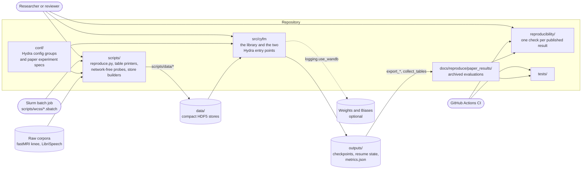
```mermaid
flowchart LR
    user(["Researcher or reviewer"])
    ci(["GitHub Actions CI"])
    slurm(["Slurm batch job<br/>scripts/wcss/*.sbatch"])

    subgraph repo["Repository"]
        conf["conf/<br/>Hydra config groups<br/>and paper experiment specs"]
        pkg["src/cyfm<br/>the library and the two<br/>Hydra entry points"]
        scripts["scripts/<br/>reproduce.py, table printers,<br/>network-free probes, store builders"]
        repro["reproducibility/<br/>one check per published result"]
        archives["docs/reproduce/paper_results/<br/>archived evaluations"]
        tests["tests/"]
    end

    raw[("Raw corpora<br/>fastMRI knee, LibriSpeech")]
    stores[("data/<br/>compact HDF5 stores")]
    outputs[("outputs/<br/>checkpoints, resume state,<br/>metrics.json")]
    wandb[("Weights and Biases<br/>optional")]

    user --> scripts
    user --> pkg
    user --> repro
    slurm --> scripts
    ci --> tests
    ci --> repro
    conf --> pkg
    conf --> scripts
    raw --> scripts
    scripts -- "scripts/data/*" --> stores
    stores --> pkg
    pkg --> outputs
    pkg -. "logging.use_wandb" .-> wandb
    outputs -- "export_*, collect_tables" --> archives
    archives --> repro
    archives --> tests
```

Nothing under `outputs/` or `data/` is tracked. What ships with the repository is the
code, the configuration, and the archived evaluations every U-Net table is read from.

## 3. Package structure and dependencies

### 3.1 Layers

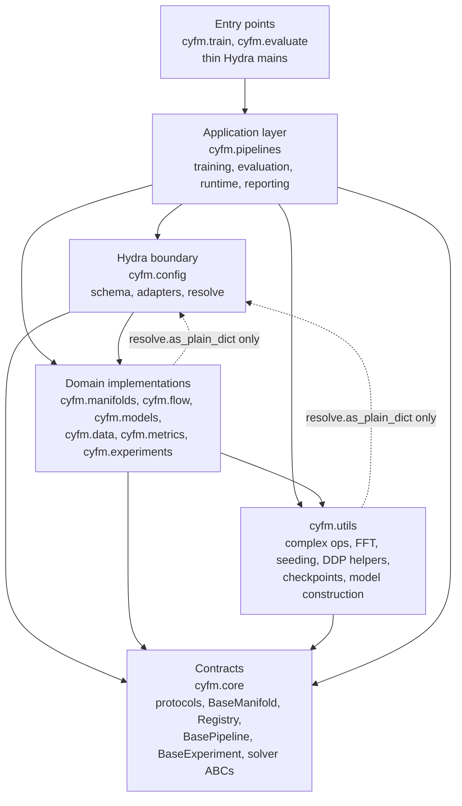
```mermaid
flowchart TB
    entry["Entry points<br/>cyfm.train, cyfm.evaluate<br/>thin Hydra mains"]
    app["Application layer<br/>cyfm.pipelines<br/>training, evaluation, runtime, reporting"]
    boundary["Hydra boundary<br/>cyfm.config<br/>schema, adapters, resolve"]
    domain["Domain implementations<br/>cyfm.manifolds, cyfm.flow, cyfm.models,<br/>cyfm.data, cyfm.metrics, cyfm.experiments"]
    utils["cyfm.utils<br/>complex ops, FFT, seeding, DDP helpers,<br/>checkpoints, model construction"]
    core["Contracts<br/>cyfm.core<br/>protocols, BaseManifold, Registry,<br/>BasePipeline, BaseExperiment, solver ABCs"]

    entry --> app
    app --> boundary
    app --> domain
    app --> utils
    boundary --> domain
    boundary --> core
    domain --> utils
    domain --> core
    utils --> core
    app --> core
    domain -. "resolve.as_plain_dict only" .-> boundary
    utils -. "resolve.as_plain_dict only" .-> boundary
```

Inside the domain layer the dependencies run one way, towards `flow`:

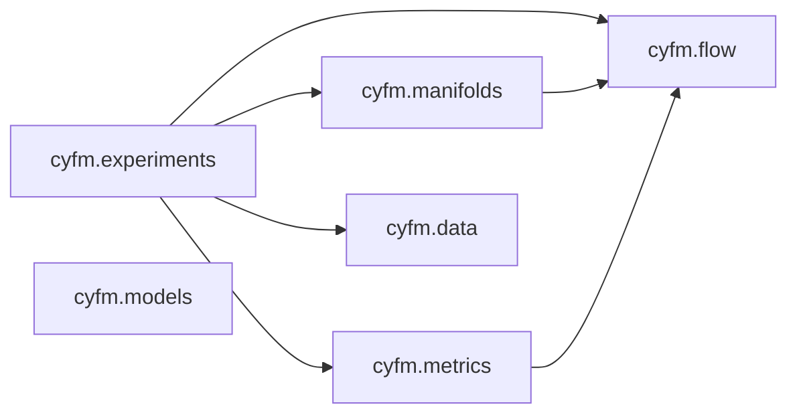
```mermaid
flowchart LR
    experiments["cyfm.experiments"] --> manifolds["cyfm.manifolds"]
    experiments --> metrics["cyfm.metrics"]
    experiments --> data["cyfm.data"]
    experiments --> flow["cyfm.flow"]
    manifolds --> flow
    metrics --> flow
    models["cyfm.models"]
```

The exact package-level imports (`from cyfm.<package>`), which the two diagrams
summarise:

| package | imports from |
| --- | --- |
| `cyfm.core` | nothing outside `cyfm.core` |
| `cyfm.models` | `core` |
| `cyfm.flow` | `core`, `utils` |
| `cyfm.metrics` | `core`, `flow` |
| `cyfm.data` | `core`, `utils`, `config.resolve` |
| `cyfm.manifolds` | `core`, `flow`, `utils`, `config.resolve` |
| `cyfm.experiments` | `core`, `data`, `flow`, `manifolds`, `metrics` |
| `cyfm.utils` | `core` (the `MODELS` registry), `config.resolve` |
| `cyfm.config` | `core`, `manifolds` (in `adapters`) |
| `cyfm.pipelines` | `config`, `core`, `data`, `flow`, `metrics`, `utils` |
| `cyfm.train`, `cyfm.evaluate` | `pipelines` (and `utils.distributed` for `train`) |

Three properties hold:

- **`cyfm.core` imports nothing else from `cyfm`.** It is the stable centre every other
  package depends on, and it is where the comparison's contract lives.
- **`cyfm.models` depends only on `cyfm.core`.** A network knows nothing about
  geometry; the geometry chooses its input and output widths
  (`in_channels = manifold.state_channels`).
- **The pipelines never import a concrete geometry, model or dataset class.** They
  reach all three through the registries, which is what makes the arm a config value.

The dotted edges all point at `cyfm.config.resolve.as_plain_dict`, a leaf module with
no `cyfm` imports. They make `cyfm.config` and `cyfm.manifolds` mutually dependent at
package level (`config.adapters` builds a manifold; `manifolds` resolves a config node
with `resolve`), but the module graph stays acyclic.

### 3.2 Repository map

| path | role |
| --- | --- |
| `src/cyfm/train.py`, `src/cyfm/evaluate.py` | Hydra entry points. Module paths are pinned by `tests/test_experiments.py`. |
| `src/cyfm/core/` | Contracts only: protocols, abstract bases, the registry. |
| `src/cyfm/config/` | The only code that sees a `DictConfig`. |
| `src/cyfm/pipelines/` | The training run and the evaluation sweep, plus loop machinery. |
| `src/cyfm/manifolds/` | The three geometries. |
| `src/cyfm/flow/` | Bridges, couplings, losses, solvers, OT primitives. |
| `src/cyfm/models/` | The paper's U-Net and a pointwise MLP control. |
| `src/cyfm/data/` | Datasets, stores, transforms, splits, ESPIRiT, download. |
| `src/cyfm/metrics/` | Metrics grouped by what they can see. |
| `src/cyfm/experiments/` | Network-free measurements behind Tables 1 and 4 and Section 5.3. |
| `src/cyfm/utils/` | Numerics and runtime helpers with no domain policy. |
| `conf/` | Hydra config groups; `conf/experiment/` holds the paper specs. |
| `scripts/` | Command-line front ends: `paper/` (orchestration, tables), `data/` (store builders), `wcss/` (Slurm jobs), top level (network-free probes). |
| `reproducibility/` | One script per published number, reporting `PASS`, `FAIL` or `MISSING INPUT`. Not in the wheel. |
| `docs/reproduce/paper_results/` | Archived `metrics.json` payloads with their Hydra overrides. |
| `tests/` | Mirrors the package layout, plus integrity tests for configs and archives. |

## 4. Core contracts

The rule `cyfm.core.protocols` states and the rest of the code follows: **an abstract
base class where there is behaviour to inherit, a `typing.Protocol` where there is only
a shape to satisfy.**

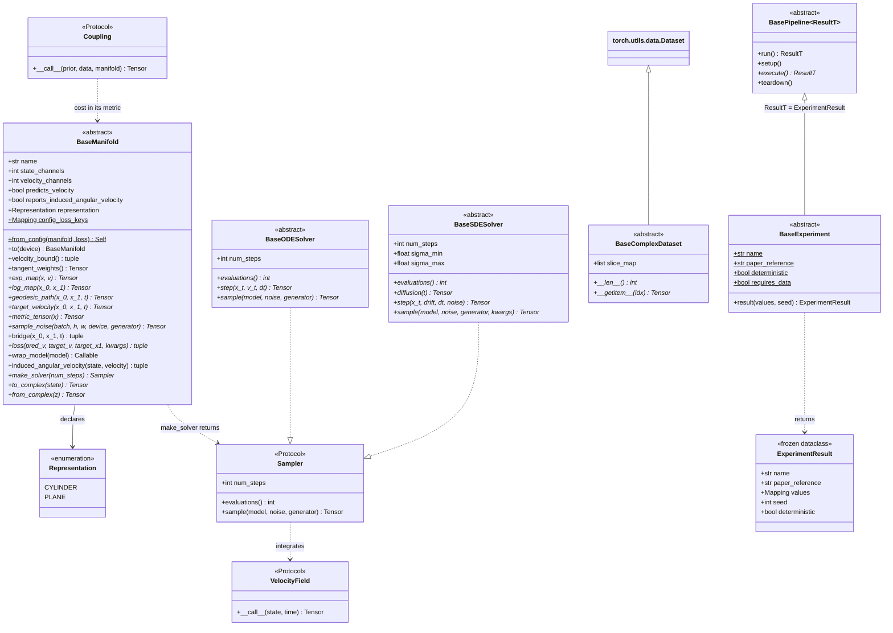
```mermaid
classDiagram
    direction TB

    class VelocityField {
        <<Protocol>>
        +#95;#95;call#95;#95;(state, time) Tensor
    }
    class Sampler {
        <<Protocol>>
        +int num_steps
        +evaluations() int
        +sample(model, noise, generator) Tensor
    }
    class Coupling {
        <<Protocol>>
        +#95;#95;call#95;#95;(prior, data, manifold) Tensor
    }
    class Representation {
        <<enumeration>>
        CYLINDER
        PLANE
    }
    class BaseManifold {
        <<abstract>>
        +str name
        +int state_channels
        +int velocity_channels
        +bool predicts_velocity
        +bool reports_induced_angular_velocity
        +Representation representation
        +Mapping config_loss_keys$
        +from_config(manifold, loss) Self$
        +to(device) BaseManifold
        +velocity_bound() tuple
        +tangent_weights() Tensor
        +exp_map(x, v) Tensor*
        +log_map(x_0, x_1) Tensor*
        +geodesic_path(x_0, x_1, t) Tensor*
        +target_velocity(x_0, x_1, t) Tensor*
        +metric_tensor(x) Tensor*
        +sample_noise(batch, h, w, device, generator) Tensor*
        +bridge(x_0, x_1, t) tuple
        +loss(pred_v, target_v, target_x1, kwargs) tuple*
        +wrap_model(model) Callable
        +induced_angular_velocity(state, velocity) tuple
        +make_solver(num_steps) Sampler*
        +to_complex(state) Tensor*
        +from_complex(z) Tensor*
    }
    class BaseODESolver {
        <<abstract>>
        +int num_steps
        +evaluations() int*
        +step(x_t, v_t, dt) Tensor*
        +sample(model, noise, generator) Tensor*
    }
    class BaseSDESolver {
        <<abstract>>
        +int num_steps
        +float sigma_min
        +float sigma_max
        +evaluations() int*
        +diffusion(t) Tensor*
        +step(x_t, drift, dt, noise) Tensor*
        +sample(model, noise, generator, kwargs) Tensor*
    }
    class TorchDataset["torch.utils.data.Dataset"]
    class BaseComplexDataset {
        <<abstract>>
        +list slice_map
        +#95;#95;len#95;#95;() int*
        +#95;#95;getitem#95;#95;(idx) Tensor*
    }
    class BasePipeline~ResultT~ {
        <<abstract>>
        +run() ResultT
        +setup()
        +execute() ResultT*
        +teardown()
    }
    class BaseExperiment {
        <<abstract>>
        +str name$
        +str paper_reference$
        +bool deterministic$
        +bool requires_data$
        +result(values, seed) ExperimentResult
    }
    class ExperimentResult {
        <<frozen dataclass>>
        +str name
        +str paper_reference
        +Mapping values
        +int seed
        +bool deterministic
    }

    BaseManifold --> Representation : declares
    BaseManifold ..> Sampler : make_solver returns
    BaseODESolver ..|> Sampler
    BaseSDESolver ..|> Sampler
    Sampler ..> VelocityField : integrates
    Coupling ..> BaseManifold : cost in its metric
    TorchDataset <|-- BaseComplexDataset
    BasePipeline <|-- BaseExperiment : ResultT = ExperimentResult
    BaseExperiment ..> ExperimentResult : returns
```

What each contract is for:

| contract | kind | why this kind |
| --- | --- | --- |
| `BaseManifold` | ABC | Carries shared behaviour (`from_config`, the default `bridge`, `wrap_model`, `tangent_weights`) and fixes the surface the two arms may differ on. Anything not declared here is shared. |
| `VelocityField` | Protocol | A network is an `nn.Module`; a second base class would add multiple inheritance for nothing. The score-based arm hands the solver a plain closure, which also satisfies it. |
| `Sampler` | Protocol | Deliberately weaker than `BaseODESolver`: the predictor-corrector sampler has no `dt` and no velocity, yet the sweep needs only `num_steps`, `evaluations` and `sample`. `evaluations` is mandatory so the reported cost cannot silently default to Heun's. |
| `Coupling` | Protocol | One method; nothing ever asks a coupling what it is. A bare function qualifies. Conformance of the shipped classes is asserted statically through `COUPLING_IMPLEMENTATIONS`. |
| `BaseODESolver` / `BaseSDESolver` | ABC | Siblings, not parent and child: an ODE step consumes a velocity and `dt`, an SDE step a drift and a Brownian increment. |
| `BaseComplexDataset` | ABC | `slice_map` is part of the interface because splits (`select_indices`) and reports read it. |
| `BasePipeline[ResultT]` | ABC, generic | Fixes the order `setup`, `execute`, `teardown` and guarantees `teardown` after `execute`. Deliberately not a framework: no hooks, no event bus. |
| `BaseExperiment` | ABC | A pipeline that returns an immutable `ExperimentResult` and prints nothing. |

## 5. Registries and plugin discovery

`Registry[T]` (`cyfm/core/registry.py`) maps a string key to a class or factory, with a
decorator for registration, `get`, `get_class` (insists on a class, so a classmethod
such as `from_config` can be called) and `build`. Duplicate keys raise unless
`force=True`. Each registry is typed to what it holds, so `mypy` rejects a class
registered into the wrong one and `build` needs no cast at the call site.

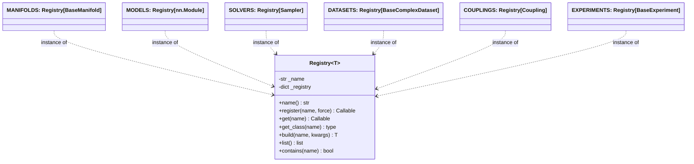
```mermaid
classDiagram
    class Registry~T~ {
        -str _name
        -dict _registry
        +name() str
        +register(name, force) Callable
        +get(name) Callable
        +get_class(name) type
        +build(name, kwargs) T
        +list() list
        +contains(name) bool
    }
    class MANIFOLDS["MANIFOLDS: Registry[BaseManifold]"]
    class MODELS["MODELS: Registry[nn.Module]"]
    class SOLVERS["SOLVERS: Registry[Sampler]"]
    class DATASETS["DATASETS: Registry[BaseComplexDataset]"]
    class COUPLINGS["COUPLINGS: Registry[Coupling]"]
    class EXPERIMENTS["EXPERIMENTS: Registry[BaseExperiment]"]
    MANIFOLDS ..> Registry : instance of
    MODELS ..> Registry : instance of
    SOLVERS ..> Registry : instance of
    DATASETS ..> Registry : instance of
    COUPLINGS ..> Registry : instance of
    EXPERIMENTS ..> Registry : instance of
```

| registry | defined in | keys (aliases share one class) | resolved by |
| --- | --- | --- | --- |
| `MANIFOLDS` | `core/registry.py` | `cylindrical`, `euclidean`, `complex_diffusion` | `manifolds.build_manifold` |
| `MODELS` | `core/registry.py` | `c_unet` = `cylindrical_unet`, `mlp` = `pointwise_mlp` | `utils.inference.build_model` |
| `SOLVERS` | `core/registry.py` | `cylindrical` = `cylindrical_heun` = `cylindrical_ode`, `euclidean` = `euclidean_heun` = `euclidean_ode`, `complex_diffusion` = `pc_diffusion` | tests only; pipelines use `manifold.make_solver` |
| `DATASETS` | `core/registry.py` | `cylinder_toy_iid`, `cylinder_toy_field`, `fastmri_knee_pd` = `knee_store`, `librispeech_stft` = `stft_store`, `fastmri` = `fast_mri` | `data.build_dataset` |
| `COUPLINGS` | `core/registry.py` | `independent` = `none`, `ot` = `optimal_transport` | `flow.couplings.build_coupling` |
| `EXPERIMENTS` | `core/experiment.py` | `bridge_geometry`, `coupling_scaling`, `factorised_trap` | not looked up by name; scripts instantiate the classes |

Registration happens at class-definition time, so a registry is only full once the
defining module has been imported. `cyfm/__init__.py` imports every populating package
explicitly, one line per registry, so population is a property of that file and not of
whichever module happened to be imported first.
`tests/test_core/test_registry_population.py` checks this in a fresh interpreter.

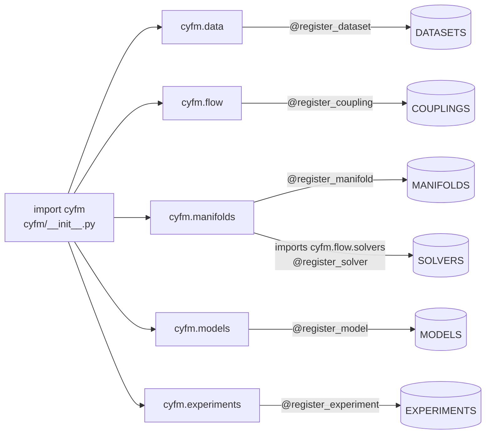
```mermaid
flowchart LR
    init["import cyfm<br/>cyfm/__init__.py"]
    init --> data["cyfm.data"]
    init --> flow["cyfm.flow"]
    init --> manifolds["cyfm.manifolds"]
    init --> models["cyfm.models"]
    init --> experiments["cyfm.experiments"]
    data -- "@register_dataset" --> DATASETS[("DATASETS")]
    flow -- "@register_coupling" --> COUPLINGS[("COUPLINGS")]
    manifolds -- "@register_manifold" --> MANIFOLDS[("MANIFOLDS")]
    manifolds -- "imports cyfm.flow.solvers<br/>@register_solver" --> SOLVERS[("SOLVERS")]
    models -- "@register_model" --> MODELS[("MODELS")]
    experiments -- "@register_experiment" --> EXPERIMENTS[("EXPERIMENTS")]
```

Every builder resolves the name through its registry and then validates the config
group against the constructor's signature (`inspect.signature`). An unknown key in the
config is an error rather than a silent no-op, and the constructor stays the single
source of truth for every default.

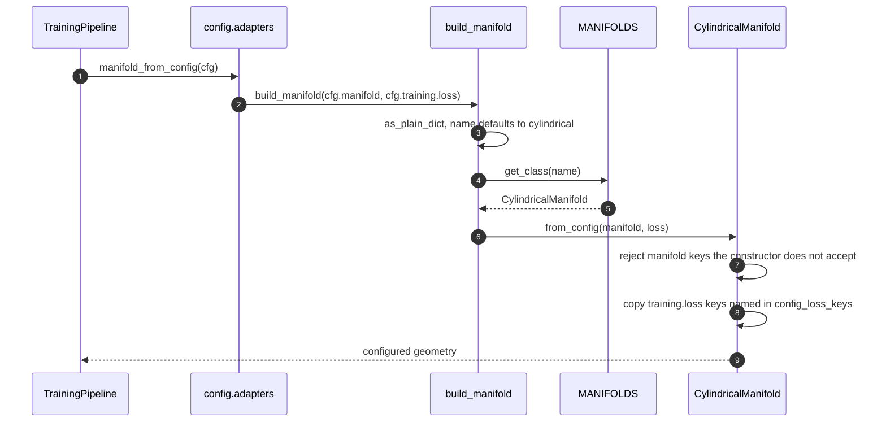
```mermaid
sequenceDiagram
    autonumber
    participant P as TrainingPipeline
    participant A as config.adapters
    participant B as build_manifold
    participant R as MANIFOLDS
    participant C as CylindricalManifold
    P->>A: manifold_from_config(cfg)
    A->>B: build_manifold(cfg.manifold, cfg.training.loss)
    B->>B: as_plain_dict, name defaults to cylindrical
    B->>R: get_class(name)
    R-->>B: CylindricalManifold
    B->>C: from_config(manifold, loss)
    C->>C: reject manifold keys the constructor does not accept
    C->>C: copy training.loss keys named in config_loss_keys
    C-->>P: configured geometry
```

## 6. Geometries

Three geometries implement `BaseManifold`. Two of them share the flat representation
through a mixin; the flow arms delegate their mathematics to bridge and loss objects
they own.

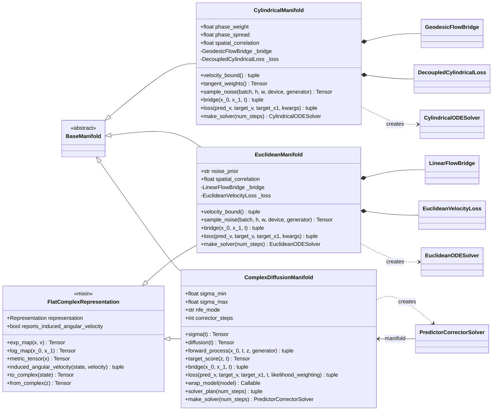
```mermaid
classDiagram
    direction LR
    class BaseManifold {
        <<abstract>>
    }
    class FlatComplexRepresentation {
        <<mixin>>
        +Representation representation
        +bool reports_induced_angular_velocity
        +exp_map(x, v) Tensor
        +log_map(x_0, x_1) Tensor
        +metric_tensor(x) Tensor
        +induced_angular_velocity(state, velocity) tuple
        +to_complex(state) Tensor
        +from_complex(z) Tensor
    }
    class CylindricalManifold {
        +float phase_weight
        +float phase_spread
        +float spatial_correlation
        -GeodesicFlowBridge _bridge
        -DecoupledCylindricalLoss _loss
        +velocity_bound() tuple
        +tangent_weights() Tensor
        +sample_noise(batch, h, w, device, generator) Tensor
        +bridge(x_0, x_1, t) tuple
        +loss(pred_v, target_v, target_x1, kwargs) tuple
        +make_solver(num_steps) CylindricalODESolver
    }
    class EuclideanManifold {
        +str noise_prior
        +float spatial_correlation
        -LinearFlowBridge _bridge
        -EuclideanVelocityLoss _loss
        +velocity_bound() tuple
        +sample_noise(batch, h, w, device, generator) Tensor
        +bridge(x_0, x_1, t) tuple
        +loss(pred_v, target_v, target_x1, kwargs) tuple
        +make_solver(num_steps) EuclideanODESolver
    }
    class ComplexDiffusionManifold {
        +float sigma_min
        +float sigma_max
        +str nfe_mode
        +int corrector_steps
        +sigma(t) Tensor
        +diffusion(t) Tensor
        +forward_process(x_0, t, z, generator) tuple
        +target_score(z, t) Tensor
        +bridge(x_0, x_1, t) tuple
        +loss(pred_v, target_v, target_x1, t, likelihood_weighting) tuple
        +wrap_model(model) Callable
        +solver_plan(num_steps) tuple
        +make_solver(num_steps) PredictorCorrectorSolver
    }
    class GeodesicFlowBridge
    class LinearFlowBridge
    class DecoupledCylindricalLoss
    class EuclideanVelocityLoss
    class CylindricalODESolver
    class EuclideanODESolver
    class PredictorCorrectorSolver

    BaseManifold <|-- CylindricalManifold
    BaseManifold <|-- EuclideanManifold
    BaseManifold <|-- ComplexDiffusionManifold
    FlatComplexRepresentation <|-- EuclideanManifold
    FlatComplexRepresentation <|-- ComplexDiffusionManifold
    CylindricalManifold *-- GeodesicFlowBridge
    CylindricalManifold *-- DecoupledCylindricalLoss
    EuclideanManifold *-- LinearFlowBridge
    EuclideanManifold *-- EuclideanVelocityLoss
    CylindricalManifold ..> CylindricalODESolver : creates
    EuclideanManifold ..> EuclideanODESolver : creates
    ComplexDiffusionManifold ..> PredictorCorrectorSolver : creates
    PredictorCorrectorSolver --> ComplexDiffusionManifold : manifold
```

How the arms differ, which is everything they are allowed to differ in:

| | `cylindrical` | `euclidean` | `complex_diffusion` |
| --- | --- | --- | --- |
| role | the method | Cartesian flow baseline | VE-SDE score baseline |
| state | `(m, cos phi, sin phi)`, 3 channels | `(Re z, Im z)`, 2 channels | `(Re z, Im z)`, 2 channels |
| `representation` | `CYLINDER` | `PLANE` (mixin) | `PLANE` (mixin) |
| prior at t=0 | `m ~ U[0,1]`, `phi ~ U[0,2pi)`; optional wrapped-normal phase and spatially correlated latents | `uniform` (the cylinder's law, no trigonometry), `matched` (replays the cylinder's RNG stream), or `gaussian`; optional spatial correlation | `N(0, sigma_max^2 I)` |
| path | linear in `m`, shorter arc in `phi` | straight line | `x_1 + sigma(1-t) z` |
| network target | velocity `(u_m, u_phi)`, `u_phi` bounded by pi | velocity `z_1 - z_0` | score `-z / sigma`; the network emits a unit-scale residual and `wrap_model` divides by sigma |
| loss | amplitude term + `lambda_phase` x phase term, optionally amplitude-weighted | one regression over both channels | denoising score matching, `g(t)^2` weighting |
| sampler | Heun, clamp `m >= 0`, re-wrap phase | Heun, vector addition | predictor-corrector (Euler-Maruyama + Langevin) |
| cost of k steps | `2k - 1` | `2k - 1` | `steps x (1 + M)`; in `nfe_mode=heun` planned to fit `2k - 1` |
| `velocity_bound` | `(1, pi)` | `(2, 2)` | none (raises) |
| `predicts_velocity` | true | true | false |
| angular-velocity probe | read directly off the prediction | induced, `(x v_y - y v_x) / A^2` | defined by the mixin, gated off by `predicts_velocity` |
| `config_loss_keys` | `amp_loss_type`, `phase_loss_type`, `lambda_phase`, `phase_amplitude_weighting` | `vel_loss_type` -> `loss_type` | none |

Two details are load-bearing for the comparison. `sample_matched_noise` repeats the
cylinder's two `torch.rand` calls in the same order, so one seed gives both flow arms the
same complex noise field. And `velocity_bound` stays on `EuclideanManifold` rather than
moving into the mixin, because the diffusion arm shares the representation but not the
prior, and inheriting `(2, 2)` would cap it far too tightly.

## 7. Flow: bridges, couplings, losses, solvers, transport

### 7.1 Solvers

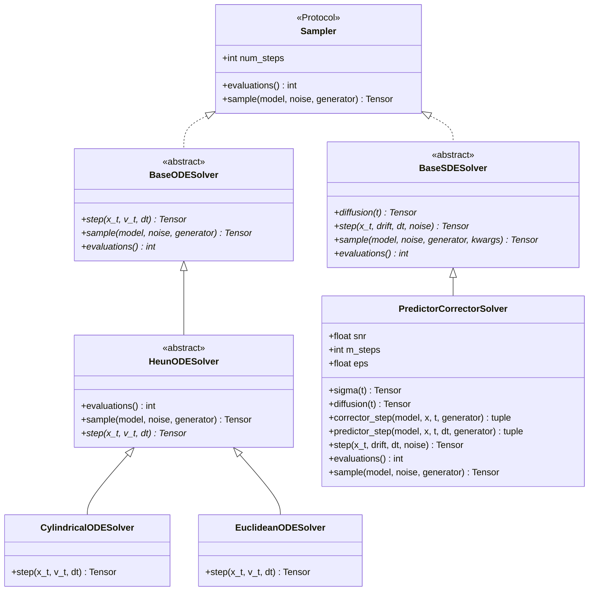
```mermaid
classDiagram
    class Sampler {
        <<Protocol>>
        +int num_steps
        +evaluations() int
        +sample(model, noise, generator) Tensor
    }
    class BaseODESolver {
        <<abstract>>
        +step(x_t, v_t, dt) Tensor*
        +sample(model, noise, generator) Tensor*
        +evaluations() int*
    }
    class HeunODESolver {
        <<abstract>>
        +evaluations() int
        +sample(model, noise, generator) Tensor
        +step(x_t, v_t, dt) Tensor*
    }
    class CylindricalODESolver {
        +step(x_t, v_t, dt) Tensor
    }
    class EuclideanODESolver {
        +step(x_t, v_t, dt) Tensor
    }
    class BaseSDESolver {
        <<abstract>>
        +diffusion(t) Tensor*
        +step(x_t, drift, dt, noise) Tensor*
        +sample(model, noise, generator, kwargs) Tensor*
        +evaluations() int*
    }
    class PredictorCorrectorSolver {
        +float snr
        +int m_steps
        +float eps
        +sigma(t) Tensor
        +diffusion(t) Tensor
        +corrector_step(model, x, t, generator) tuple
        +predictor_step(model, x, t, dt, generator) tuple
        +step(x_t, drift, dt, noise) Tensor
        +evaluations() int
        +sample(model, noise, generator) Tensor
    }
    Sampler <|.. BaseODESolver
    Sampler <|.. BaseSDESolver
    BaseODESolver <|-- HeunODESolver
    HeunODESolver <|-- CylindricalODESolver
    HeunODESolver <|-- EuclideanODESolver
    BaseSDESolver <|-- PredictorCorrectorSolver
```

`HeunODESolver.sample` is a template method: the predictor-corrector loop is written
once and each geometry supplies only `step` (the cylinder clamps the amplitude and
re-projects the phase onto the circle; the plane adds). The cost convention is one
function, `heun_evaluations(k) = 2k - 1`, which both `HeunODESolver.evaluations` and the
diffusion arm's budget planner (`plan_within_budget`) call, so the two sides of a table
read their budget off the same rule.

### 7.2 Couplings, bridges and losses

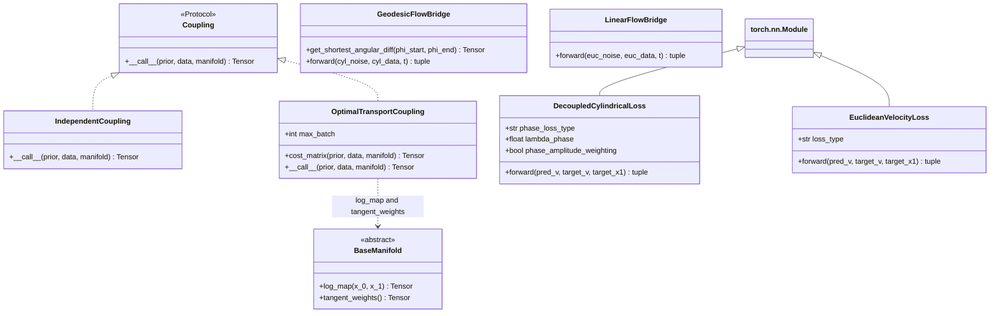
```mermaid
classDiagram
    class Coupling {
        <<Protocol>>
        +#95;#95;call#95;#95;(prior, data, manifold) Tensor
    }
    class IndependentCoupling {
        +#95;#95;call#95;#95;(prior, data, manifold) Tensor
    }
    class OptimalTransportCoupling {
        +int max_batch
        +cost_matrix(prior, data, manifold) Tensor
        +#95;#95;call#95;#95;(prior, data, manifold) Tensor
    }
    class BaseManifold {
        <<abstract>>
        +log_map(x_0, x_1) Tensor
        +tangent_weights() Tensor
    }
    class GeodesicFlowBridge {
        +get_shortest_angular_diff(phi_start, phi_end) Tensor
        +forward(cyl_noise, cyl_data, t) tuple
    }
    class LinearFlowBridge {
        +forward(euc_noise, euc_data, t) tuple
    }
    class TorchModule["torch.nn.Module"]
    class DecoupledCylindricalLoss {
        +str phase_loss_type
        +float lambda_phase
        +bool phase_amplitude_weighting
        +forward(pred_v, target_v, target_x1) tuple
    }
    class EuclideanVelocityLoss {
        +str loss_type
        +forward(pred_v, target_v, target_x1) tuple
    }
    Coupling <|.. IndependentCoupling
    Coupling <|.. OptimalTransportCoupling
    OptimalTransportCoupling ..> BaseManifold : log_map and tangent_weights
    TorchModule <|-- DecoupledCylindricalLoss
    TorchModule <|-- EuclideanVelocityLoss
```

`OptimalTransportCoupling` builds a `[B, B]` cost matrix one row at a time from the
geometry's own `log_map`, weighted per tangent channel by `tangent_weights`, and solves
one exact linear assignment (`scipy.optimize.linear_sum_assignment`) over the whole
batch. Both geometries go through the same code, so a comparison varies the geometry,
not the solver. **There is deliberately no factorised coupling** (amplitude and phase
solved separately): it keeps both marginals exact while destroying the joint
distribution, which `FactorisedTrapExperiment` measures.

`cyfm.flow.transport` is a module of functions, not classes: exact 1D transport on the
line (`sorted_transport_permutation`) and on the circle
(`circular_transport_permutation`), the joint cylinder assignment, the transport cost,
and the sliced and exact W2 estimators the metrics use.

## 8. Models

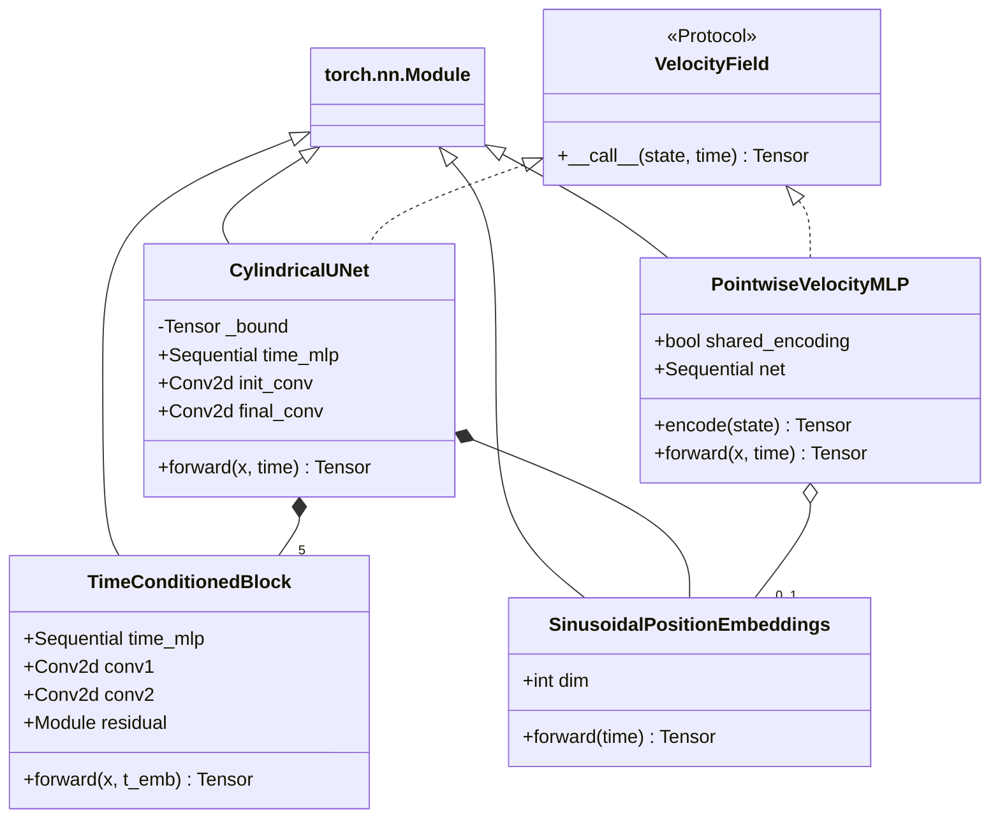
```mermaid
classDiagram
    class TorchModule["torch.nn.Module"]
    class VelocityField {
        <<Protocol>>
        +#95;#95;call#95;#95;(state, time) Tensor
    }
    class CylindricalUNet {
        -Tensor _bound
        +Sequential time_mlp
        +Conv2d init_conv
        +Conv2d final_conv
        +forward(x, time) Tensor
    }
    class TimeConditionedBlock {
        +Sequential time_mlp
        +Conv2d conv1
        +Conv2d conv2
        +Module residual
        +forward(x, t_emb) Tensor
    }
    class PointwiseVelocityMLP {
        +bool shared_encoding
        +Sequential net
        +encode(state) Tensor
        +forward(x, time) Tensor
    }
    class SinusoidalPositionEmbeddings {
        +int dim
        +forward(time) Tensor
    }
    TorchModule <|-- CylindricalUNet
    TorchModule <|-- PointwiseVelocityMLP
    TorchModule <|-- TimeConditionedBlock
    TorchModule <|-- SinusoidalPositionEmbeddings
    VelocityField <|.. CylindricalUNet
    VelocityField <|.. PointwiseVelocityMLP
    CylindricalUNet *-- "5" TimeConditionedBlock
    CylindricalUNet *-- SinusoidalPositionEmbeddings
    PointwiseVelocityMLP o-- "0..1" SinusoidalPositionEmbeddings
```

One trunk serves every geometry; only the width of `init_conv` follows
`manifold.state_channels`. `init_conv` is constructed **last**, so with one seed every
other module draws from the RNG at the same stream position in both geometries and the
two arms start from element-wise identical weights everywhere else. An optional
per-channel `velocity_bound` from the geometry is applied as `bound * tanh(v / bound)`.

`b` is `base_channels` (64 in `conf/model/c_unet.yaml`). Every `TimeConditionedBlock`
receives the time embedding `t_emb`.

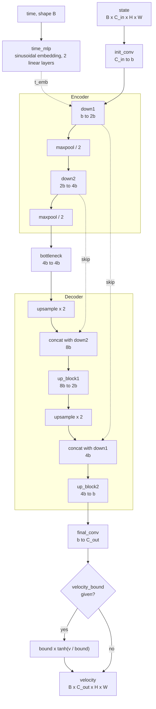
```mermaid
flowchart TB
    x["state<br/>B x C_in x H x W"] --> ic["init_conv<br/>C_in to b"]
    t["time, shape B"] --> tm["time_mlp<br/>sinusoidal embedding, 2 linear layers"]
    tm -. "t_emb" .-> d1
    subgraph encoder["Encoder"]
        d1["down1<br/>b to 2b"] --> p1["maxpool / 2"] --> d2["down2<br/>2b to 4b"] --> p2["maxpool / 2"]
    end
    ic --> d1
    p2 --> bn["bottleneck<br/>4b to 4b"]
    subgraph decoder["Decoder"]
        u1["upsample x 2"] --> c1["concat with down2<br/>8b"] --> ub1["up_block1<br/>8b to 2b"]
        ub1 --> u2["upsample x 2"] --> c2["concat with down1<br/>4b"] --> ub2["up_block2<br/>4b to b"]
    end
    bn --> u1
    d2 -. "skip" .-> c1
    d1 -. "skip" .-> c2
    ub2 --> fc["final_conv<br/>b to C_out"] --> bd{"velocity_bound<br/>given?"}
    bd -- "yes" --> th["bound x tanh(v / bound)"] --> v["velocity<br/>B x C_out x H x W"]
    bd -- "no" --> v
```

The downsampling depth is why every field is cropped to a multiple of `CROP_BASE = 16`
(`CenterCropModulo`) before it reaches the network. The MLP is the control for fields
without spatial structure; with `shared_encoding: true` (`conf/model/mlp_gate.yaml`)
both geometries see the identical five-channel encoding `(re, im, m, cos phi, sin phi)`.

## 9. Data

### 9.1 Datasets and stores

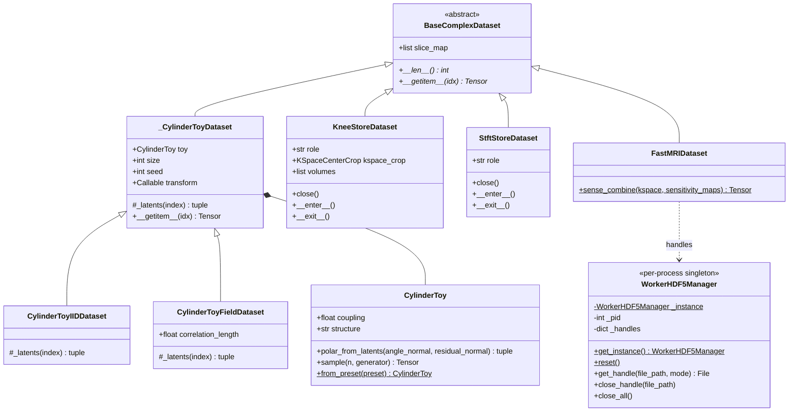
```mermaid
classDiagram
    class BaseComplexDataset {
        <<abstract>>
        +list slice_map
        +#95;#95;len#95;#95;() int*
        +#95;#95;getitem#95;#95;(idx) Tensor*
    }
    class CylinderToyBase["_CylinderToyDataset"] {
        +CylinderToy toy
        +int size
        +int seed
        +Callable transform
        #_latents(index) tuple
        +#95;#95;getitem#95;#95;(idx) Tensor
    }
    class CylinderToyIIDDataset {
        #_latents(index) tuple
    }
    class CylinderToyFieldDataset {
        +float correlation_length
        #_latents(index) tuple
    }
    class CylinderToy {
        +float coupling
        +str structure
        +polar_from_latents(angle_normal, residual_normal) tuple
        +sample(n, generator) Tensor
        +from_preset(preset) CylinderToy$
    }
    class KneeStoreDataset {
        +str role
        +KSpaceCenterCrop kspace_crop
        +list volumes
        +close()
        +#95;#95;enter#95;#95;()
        +#95;#95;exit#95;#95;()
    }
    class StftStoreDataset {
        +str role
        +close()
        +#95;#95;enter#95;#95;()
        +#95;#95;exit#95;#95;()
    }
    class FastMRIDataset {
        +sense_combine(kspace, sensitivity_maps) Tensor$
    }
    class WorkerHDF5Manager {
        <<per-process singleton>>
        -WorkerHDF5Manager _instance$
        -int _pid
        -dict _handles
        +get_instance() WorkerHDF5Manager$
        +reset()$
        +get_handle(file_path, mode) File
        +close_handle(file_path)
        +close_all()
    }
    BaseComplexDataset <|-- CylinderToyBase
    CylinderToyBase <|-- CylinderToyIIDDataset
    CylinderToyBase <|-- CylinderToyFieldDataset
    CylinderToyBase *-- CylinderToy
    BaseComplexDataset <|-- KneeStoreDataset
    BaseComplexDataset <|-- StftStoreDataset
    BaseComplexDataset <|-- FastMRIDataset
    FastMRIDataset ..> WorkerHDF5Manager : handles
```

- **Synthetic cohorts** (`cylinder_toy_iid`, `cylinder_toy_field`) never touch disk.
  Sample `i` is drawn from `seed + i`, so it is stable across epochs, workers and
  processes. The two differ only in `_latents` (template method): the field variant
  smooths the latent normals before the copula, which leaves every pointwise marginal
  unchanged.
- **Compact stores** (`KneeStoreDataset`, `StftStoreDataset`; `AudioStoreDataset` is an
  alias) read HDF5 files built ahead of time by `scripts/data/`. Training never sees raw
  k-space, ESPIRiT or audio decoding. Splits are by volume or by speaker, assigned by
  hashing the id, so adding data never moves an existing item across the split. Each
  store opens its handle lazily per worker and closes it deterministically
  (`close`, context manager, `__del__`).
- **`FastMRIDataset`** reads raw multi-coil k-space for a debug subset and is not used
  by any paper result. It shares HDF5 handles through the per-process
  `WorkerHDF5Manager`, which re-creates its handles when it detects a new PID.

Every dataset returns an **unnormalised** complex field `[1, H, W]` passed through the
`transform` it was given. Normalisation lives in one place, the transform, for every
cohort.

### 9.2 The preprocessing chain

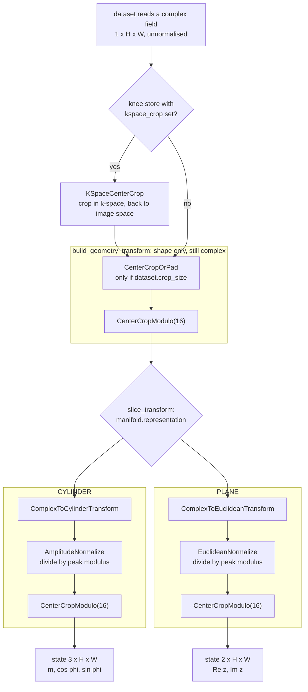
```mermaid
flowchart TB
    ds["dataset reads a complex field<br/>1 x H x W, unnormalised"] --> kc{"knee store with<br/>kspace_crop set?"}
    kc -- "yes" --> ksc["KSpaceCenterCrop<br/>crop in k-space, back to image space"] --> g1
    kc -- "no" --> g1
    subgraph geo["build_geometry_transform: shape only, still complex"]
        g1["CenterCropOrPad<br/>only if dataset.crop_size"] --> g2["CenterCropModulo(16)"]
    end
    g2 --> sel{"slice_transform:<br/>manifold.representation"}
    subgraph cyl["CYLINDER"]
        c1["ComplexToCylinderTransform"] --> c2["AmplitudeNormalize<br/>divide by peak modulus"] --> c3["CenterCropModulo(16)"]
    end
    subgraph pl["PLANE"]
        p1["ComplexToEuclideanTransform"] --> p2["EuclideanNormalize<br/>divide by peak modulus"] --> p3["CenterCropModulo(16)"]
    end
    sel --> c1
    sel --> p1
    c3 --> cs["state 3 x H x W<br/>m, cos phi, sin phi"]
    p3 --> ps["state 2 x H x W<br/>Re z, Im z"]
```

`slice_transform` looks the three representation-specific stages up in a table
(`_PIPELINES`, keyed by `Representation`) and composes them in a fixed order that is
written once: convert, normalise before cropping, crop to the model's divisibility. The
evaluation sweep builds its reference cohort through the same function
(`training_pipeline`), and `assert_training_domain` checks that no reference field has a
peak modulus above one before any metric is computed.

### 9.3 Splits

`load_split_file_names` reads a split manifest and `select_indices` gates a dataset's
`slice_map` down to it. The training pipeline wraps the dataset in a `Subset` when the
split is a strict subset, so training and evaluation see disjoint volumes through the
same two functions.

## 10. The configuration boundary

`cyfm.config` is the only package that knows about `DictConfig`. Everything the entry
points read is parsed once, at construction, into frozen dataclasses whose defaults
reproduce `conf/` exactly; `tests/test_config/test_schema_matches_conf.py` reads the
YAML and asserts it field by field.

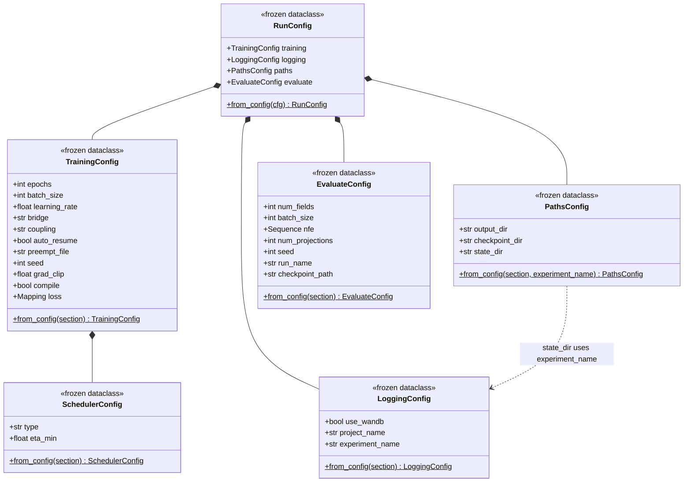
```mermaid
classDiagram
    class RunConfig {
        <<frozen dataclass>>
        +TrainingConfig training
        +LoggingConfig logging
        +PathsConfig paths
        +EvaluateConfig evaluate
        +from_config(cfg) RunConfig$
    }
    class TrainingConfig {
        <<frozen dataclass>>
        +int epochs
        +int batch_size
        +float learning_rate
        +str bridge
        +str coupling
        +bool auto_resume
        +str preempt_file
        +int seed
        +float grad_clip
        +bool compile
        +Mapping loss
        +from_config(section) TrainingConfig$
    }
    class SchedulerConfig {
        <<frozen dataclass>>
        +str type
        +float eta_min
        +from_config(section) SchedulerConfig$
    }
    class LoggingConfig {
        <<frozen dataclass>>
        +bool use_wandb
        +str project_name
        +str experiment_name
        +from_config(section) LoggingConfig$
    }
    class PathsConfig {
        <<frozen dataclass>>
        +str output_dir
        +str checkpoint_dir
        +str state_dir
        +from_config(section, experiment_name) PathsConfig$
    }
    class EvaluateConfig {
        <<frozen dataclass>>
        +int num_fields
        +int batch_size
        +Sequence nfe
        +int num_projections
        +int seed
        +str run_name
        +str checkpoint_path
        +from_config(section) EvaluateConfig$
    }
    RunConfig *-- TrainingConfig
    RunConfig *-- LoggingConfig
    RunConfig *-- PathsConfig
    RunConfig *-- EvaluateConfig
    TrainingConfig *-- SchedulerConfig
    PathsConfig ..> LoggingConfig : state_dir uses experiment_name
```

`RunConfig.from_config` parses `logging` before `paths`, because `paths.state_dir`
interpolates `logging.experiment_name` in the YAML and must be derived the same way
here. The `manifold`, `model` and `dataset` groups are not typed records: each is
validated by the class it selects (`from_config`, `build_model`, `build_dataset`).

The Hydra tree that feeds it:

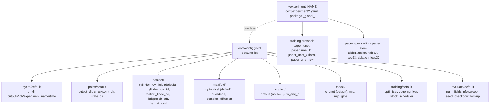
```mermaid
flowchart TB
    root["conf/config.yaml<br/>defaults list"]
    root --> hydra["hydra/default<br/>run dir outputs/job/experiment_name/time"]
    root --> paths["paths/default<br/>output_dir, checkpoint_dir, state_dir"]
    root --> dataset["dataset/<br/>cylinder_toy_field (default), cylinder_toy_iid,<br/>fastmri_knee_pd, librispeech_stft, fastmri_local"]
    root --> manifold["manifold/<br/>cylindrical (default), euclidean, complex_diffusion"]
    root --> logging["logging/<br/>default (no W&B), w_and_b"]
    root --> model["model/<br/>c_unet (default), mlp, mlp_gate"]
    root --> training["training/default<br/>optimiser, coupling, loss block, scheduler"]
    root --> evaluate["evaluate/default<br/>num_fields, nfe sweep, seed, checkpoint lookup"]
    exp["+experiment=NAME<br/>conf/experiment/*.yaml, package _global_"] -. "overlays" .-> root
    exp --> protocols["training protocols<br/>paper_unet, paper_unet_l1, paper_unet_v1loss, paper_unet_l2w"]
    exp --> specs["paper specs with a paper: block<br/>table1..table6, tableA, sec53, ablation_loss32"]
```

One `training.loss` block serves every geometry; each geometry picks the keys that
apply to it through `config_loss_keys`, which is why `training.loss.*` overrides keep
working across the manifold switch.

## 11. Pipelines

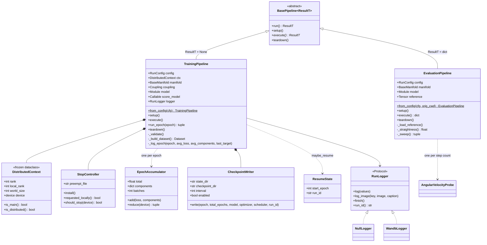
```mermaid
classDiagram
    class BasePipeline~ResultT~ {
        <<abstract>>
        +run() ResultT
        +setup()
        +execute() ResultT*
        +teardown()
    }
    class TrainingPipeline {
        +RunConfig config
        +DistributedContext ctx
        +BaseManifold manifold
        +Coupling coupling
        +Module model
        +Callable score_model
        +RunLogger logger
        +from_config(cfg) TrainingPipeline$
        +setup()
        +execute()
        +run_epoch(epoch) tuple
        +teardown()
        -_validate()
        -_build_dataset() Dataset
        -_log_epoch(epoch, avg_loss, avg_components, last_target)
    }
    class EvaluationPipeline {
        +RunConfig config
        +BaseManifold manifold
        +Module model
        +Tensor reference
        +from_config(cfg, orig_cwd) EvaluationPipeline$
        +setup()
        +execute() dict
        +teardown()
        -_load_reference()
        -_straightness() float
        -_sweep() tuple
    }
    class DistributedContext {
        <<frozen dataclass>>
        +int rank
        +int local_rank
        +int world_size
        +device device
        +is_main() bool
        +is_distributed() bool
    }
    class StopController {
        +str preempt_file
        +install()
        +requested_locally() bool
        +should_stop(device) bool
    }
    class EpochAccumulator {
        +float total
        +dict components
        +int batches
        +add(loss, components)
        +reduce(device) tuple
    }
    class CheckpointWriter {
        +str state_dir
        +str checkpoint_dir
        +int interval
        +bool enabled
        +write(epoch, total_epochs, model, optimizer, scheduler, run_id)
    }
    class ResumeState {
        +int start_epoch
        +str run_id
    }
    class RunLogger {
        <<Protocol>>
        +log(values)
        +log_image(key, image, caption)
        +finish()
        +run_id() str
    }
    class NullLogger
    class WandbLogger
    class AngularVelocityProbe

    BasePipeline <|-- TrainingPipeline : ResultT = None
    BasePipeline <|-- EvaluationPipeline : ResultT = dict
    TrainingPipeline *-- DistributedContext
    TrainingPipeline *-- StopController
    TrainingPipeline *-- CheckpointWriter
    TrainingPipeline ..> EpochAccumulator : one per epoch
    TrainingPipeline ..> ResumeState : maybe_resume
    TrainingPipeline --> RunLogger
    RunLogger <|.. NullLogger
    RunLogger <|.. WandbLogger
    EvaluationPipeline ..> AngularVelocityProbe : one per step count
```

`train.py` and `evaluate.py` used to be single Hydra `main` functions of 535 and 226
lines with no seam for a unit test. They are now humble objects: compose the config,
hand it to a pipeline, and (for evaluation) print and write what the pipeline returned.
The pipeline can be built from a plain dict in a test.

The helpers in `pipelines/runtime.py` are the loop machinery around the algorithm:
`build_dataloader` (a `DistributedSampler` only when there are ranks),
`build_optimizer_and_scheduler` (AdamW and cosine, built on the bare module before any
wrapper), `maybe_resume`, `wrap_for_execution` (DDP, then `torch.compile`, in that
order), and three stateful helpers. `CheckpointWriter` writes on rank 0 only;
`StopController` and `EpochAccumulator` are
collective on purpose: every rank must reach the same decision and pack its reduction in
the same order (component names are sorted), or the ranks deadlock or silently swap
loss components.

## 12. Runtime behaviour

### 12.1 A training run

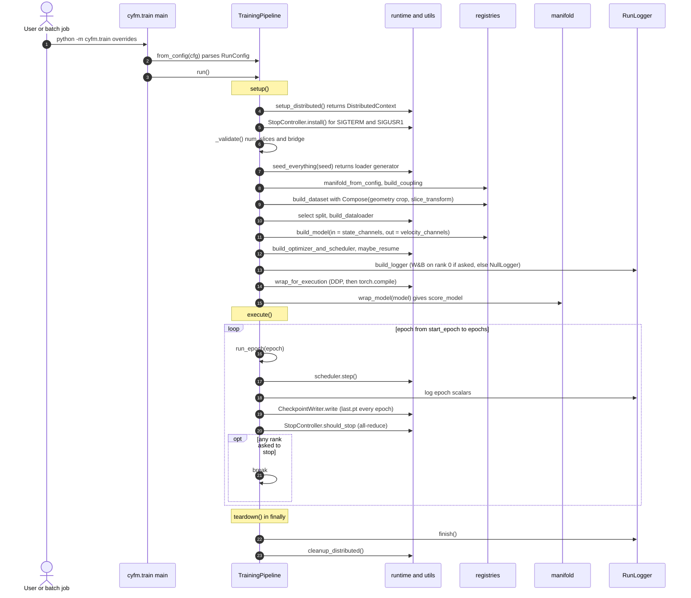
```mermaid
sequenceDiagram
    autonumber
    actor U as User or batch job
    participant M as cyfm.train main
    participant TP as TrainingPipeline
    participant RT as runtime and utils
    participant REG as registries
    participant MF as manifold
    participant L as RunLogger
    U->>M: python -m cyfm.train overrides
    M->>TP: from_config(cfg) parses RunConfig
    M->>TP: run()
    Note over TP: setup()
    TP->>RT: setup_distributed() returns DistributedContext
    TP->>RT: StopController.install() for SIGTERM and SIGUSR1
    TP->>TP: _validate() num_slices and bridge
    TP->>RT: seed_everything(seed) returns loader generator
    TP->>REG: manifold_from_config, build_coupling
    TP->>REG: build_dataset with Compose(geometry crop, slice_transform)
    TP->>RT: select split, build_dataloader
    TP->>REG: build_model(in = state_channels, out = velocity_channels)
    TP->>RT: build_optimizer_and_scheduler, maybe_resume
    TP->>L: build_logger (W&B on rank 0 if asked, else NullLogger)
    TP->>RT: wrap_for_execution (DDP, then torch.compile)
    TP->>MF: wrap_model(model) gives score_model
    Note over TP: execute()
    loop epoch from start_epoch to epochs
        TP->>TP: run_epoch(epoch)
        TP->>RT: scheduler.step()
        TP->>L: log epoch scalars
        TP->>RT: CheckpointWriter.write (last.pt every epoch)
        TP->>RT: StopController.should_stop (all-reduce)
        opt any rank asked to stop
            TP->>TP: break
        end
    end
    Note over TP: teardown() in finally
    TP->>L: finish()
    TP->>RT: cleanup_distributed()
```

### 12.2 One training step

The five lines that are the algorithm stay together in `run_epoch`, in order, because
reading them in one place is how anyone checks the code implements the paper.

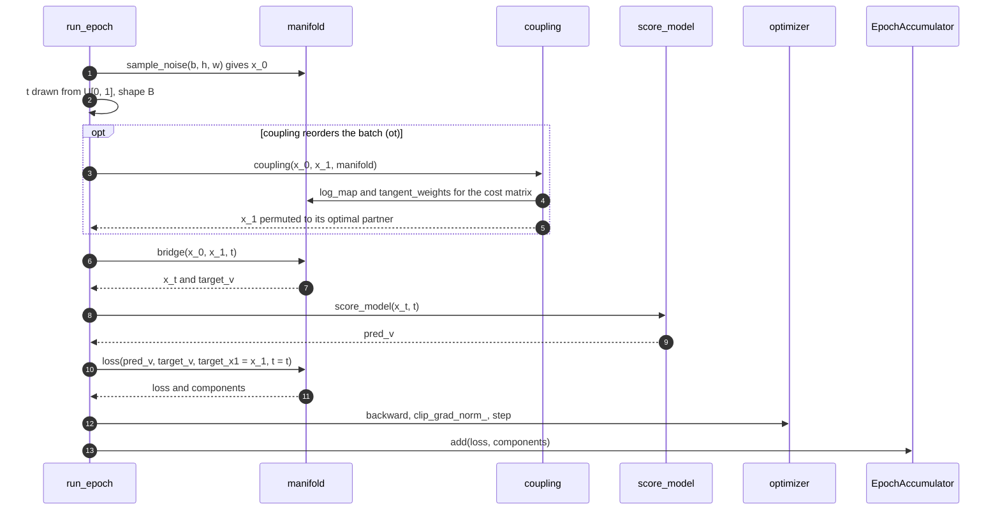
```mermaid
sequenceDiagram
    autonumber
    participant E as run_epoch
    participant MF as manifold
    participant C as coupling
    participant N as score_model
    participant O as optimizer
    participant A as EpochAccumulator
    E->>MF: sample_noise(b, h, w) gives x_0
    E->>E: t drawn from U[0, 1], shape B
    opt coupling reorders the batch (ot)
        E->>C: coupling(x_0, x_1, manifold)
        C->>MF: log_map and tangent_weights for the cost matrix
        C-->>E: x_1 permuted to its optimal partner
    end
    E->>MF: bridge(x_0, x_1, t)
    MF-->>E: x_t and target_v
    E->>N: score_model(x_t, t)
    N-->>E: pred_v
    E->>MF: loss(pred_v, target_v, target_x1 = x_1, t = t)
    MF-->>E: loss and components
    E->>O: backward, clip_grad_norm_, step
    E->>A: add(loss, components)
```

The permuted `x_1` replaces the original before the bridge, so the endpoint the path
integrates towards and the endpoint the loss weights by are the same sample.

### 12.3 An evaluation sweep

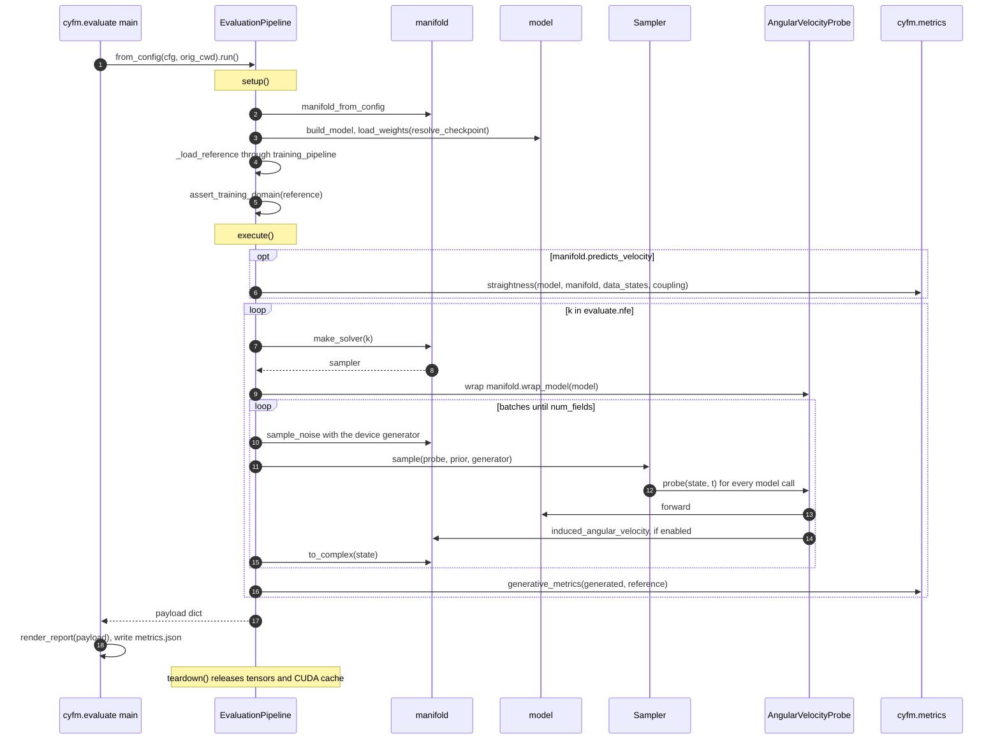
```mermaid
sequenceDiagram
    autonumber
    participant M as cyfm.evaluate main
    participant EP as EvaluationPipeline
    participant MF as manifold
    participant MOD as model
    participant S as Sampler
    participant P as AngularVelocityProbe
    participant MET as cyfm.metrics
    M->>EP: from_config(cfg, orig_cwd).run()
    Note over EP: setup()
    EP->>MF: manifold_from_config
    EP->>MOD: build_model, load_weights(resolve_checkpoint)
    EP->>EP: _load_reference through training_pipeline
    EP->>EP: assert_training_domain(reference)
    Note over EP: execute()
    opt manifold.predicts_velocity
        EP->>MET: straightness(model, manifold, data_states, coupling)
    end
    loop k in evaluate.nfe
        EP->>MF: make_solver(k)
        MF-->>EP: sampler
        EP->>P: wrap manifold.wrap_model(model)
        loop batches until num_fields
            EP->>MF: sample_noise with the device generator
            EP->>S: sample(probe, prior, generator)
            S->>P: probe(state, t) for every model call
            P->>MOD: forward
            P->>MF: induced_angular_velocity, if enabled
            EP->>MF: to_complex(state)
        end
        EP->>MET: generative_metrics(generated, reference)
    end
    EP-->>M: payload dict
    M->>M: render_report(payload), write metrics.json
    Note over EP: teardown() releases tensors and CUDA cache
```

Two generators are seeded from `evaluate.seed`: one on the sampling device, one on the
CPU for the metrics, because torch refuses a generator on a different device from the
tensor it fills. The payload **omits** families that do not apply (straightness and the
angular probe for the score-based arm) instead of writing `null` or `0.0`, and the table
scripts rely on that absence. The sweep records `nfe` (read off `solver.evaluations`)
and `executed_steps` next to the requested `num_steps`, because the two differ in the
diffusion arm's matched mode.

### 12.4 Pipeline lifecycle

```mermaid
stateDiagram-v2
    [*] --> Constructed : from_config(cfg)
    Constructed --> SettingUp : run()
    SettingUp --> Executing : setup() returns
    SettingUp --> [*] : setup() raises, teardown not called
    Executing --> TearingDown : execute() returns
    Executing --> TearingDown : execute() raises
    TearingDown --> [*] : result returned or exception re-raised
```

### 12.5 A training run under a scheduler

```mermaid
stateDiagram-v2
    [*] --> Fresh : auto_resume off, or no last.pt
    [*] --> Resumed : auto_resume on and last.pt exists
    Resumed --> Training : weights, optimiser moments, LR position restored
    Fresh --> Training
    Training --> EpochDone : run_epoch
    EpochDone --> Training : more epochs, no stop request
    EpochDone --> Stopped : signal or preempt_file seen on any rank
    EpochDone --> Finished : last epoch
    Stopped --> [*] : requeued job resumes from last.pt
    Finished --> [*]

    note right of EpochDone
        last.pt written atomically every epoch
        checkpoint_epoch_N.pt every 10 epochs and at the end
    end note
```

The two checkpoint kinds are deliberately different files in different trees.
`outputs/state/<experiment_name>/last.pt` is the full resume payload, written through a
temporary file and `os.replace`, so an interruption can never leave a half-written
state. `checkpoint_epoch_N.pt` is a bare `state_dict` (compile prefix stripped) under
the run directory, which `resolve_checkpoint` finds by globbing
`outputs/train/<run_name>/` for the newest `.pt`. Putting `last.pt` in that tree would
make evaluation pick it up and fail to load it.

A stop request can arrive two ways: `SIGTERM` or `SIGUSR1`, or the existence of the
file named by `training.preempt_file`. The file exists because a signal does not
survive the relay from a batch script through `srun`, `uv` and the `torchrun` agent. The
mechanism is in the loop; none of the batch scripts shipped in `scripts/wcss/` sets
`training.preempt_file` today.

## 13. Metrics and network-free experiments

### 13.1 Metrics

```mermaid
flowchart LR
    sweep["EvaluationPipeline._sweep"] --> gm["summary.generative_metrics<br/>the one call per step count"]
    gm --> dist["distributional<br/>sliced W2 on C, exact W2 of amplitude on the line<br/>and of phase on the circle, dependence gap"]
    gm --> spat["spatial<br/>lag-1 amplitude correlation,<br/>lag-1 phase coherence on the measured support"]
    gm --> spec["spectral<br/>radial power spectrum gap"]
    dist --> tr["flow.transport<br/>sorted, circular and sliced estimators"]
    gm --> bud["budgets<br/>subsample above 8192 exact / 65536 sliced coefficients"]
    ep["EvaluationPipeline"] --> geo["geometry<br/>straightness, AngularVelocityProbe"]
    geo -. "gated on predicts_velocity and<br/>reports_induced_angular_velocity" .-> mf["manifold"]
```

The package is split by what each metric can see: the pooled cloud of coefficients,
the nearest neighbour, every scale at once, and the path rather than the endpoint.
`generative_metrics` is a facade over the first three; the path metrics need the model
and the geometry and are called separately. Every endpoint metric is computed for every
dataset; there is no per-domain selection.

### 13.2 Network-free experiments

```mermaid
classDiagram
    class BasePipeline~ResultT~ {
        <<abstract>>
    }
    class BaseExperiment {
        <<abstract>>
        +result(values, seed) ExperimentResult
    }
    class BridgeGeometryExperiment {
        paper_reference Table 1
        +execute() ExperimentResult
    }
    class FactorisedTrapExperiment {
        paper_reference Table 4
        +execute() ExperimentResult
    }
    class CouplingScalingExperiment {
        paper_reference Section 5.3
        +execute() ExperimentResult
    }
    class ExperimentResult {
        <<frozen dataclass>>
    }
    BasePipeline <|-- BaseExperiment
    BaseExperiment <|-- BridgeGeometryExperiment
    BaseExperiment <|-- FactorisedTrapExperiment
    BaseExperiment <|-- CouplingScalingExperiment
    BaseExperiment ..> ExperimentResult : returns
```

Each experiment returns its numbers as plain containers inside a frozen
`ExperimentResult` and prints nothing. A module-level `render(result)` in the same file
turns a result into text, and a thin script in `scripts/` (named by path in the
experiment config) parses arguments, runs the experiment, prints the rendering and can
write JSON. The reproduction checks import the same classes, so the numbers a reviewer
checks and the numbers the script prints come from one code path.

## 14. The reproduction layer

```mermaid
flowchart TB
    spec["conf/experiment/NAME.yaml<br/>paper: block, kind unet_grid or commands"]
    rp["scripts/paper/reproduce.py<br/>PAPER_ORDER, --seeds, --sides, --tag, --dry-run"]
    spec --> rp
    rp -- "unet_grid: one run per<br/>side x arm x geometry x coupling x seed" --> tr["python -m cyfm.train"]
    tr --> ev["python -m cyfm.evaluate"]
    ev --> mj[("outputs/evaluate/NAME_eval/*/metrics.json")]
    mj -. "exists: run skipped" .-> rp
    rp -- "commands" --> cli["scripts/*.py<br/>thin front ends"]
    cli --> exps["cyfm.experiments"]
    rp -- "report" --> printers["scripts/paper/paper_tables.py,<br/>loss_protocols.py, ablation_tables.py"]
    mj --> export["scripts/paper/export_*.py, collect_tables.py"]
    export --> arch[("docs/reproduce/paper_results/*.json<br/>payload plus Hydra overrides")]
    arch --> printers
    arch --> latex["scripts/paper/latex_tables.py<br/>docs/reproduce/paper_results/latex/"]
    arch --> checks["reproducibility/*.py"]
    exps --> checks
    expected["reproducibility/expected.py<br/>values quoted from the paper, with tolerances"] --> checks
    checks --> verdict{{"PASS / FAIL / MISSING INPUT"}}
    arch --> tpr["tests/test_paper_results.py<br/>overrides compose to the named experiment"]
    spec --> tpr
```

Two questions are checked separately. `tests/test_paper_results.py` asks whether each
archived run is the run the paper says it is (its recorded Hydra overrides compose to
the experiment config it claims). `reproducibility/` asks whether the numbers inside
those runs, or recomputed from scratch for the network-free results, are the numbers
the paper prints.

```mermaid
classDiagram
    class Outcome {
        <<enumeration>>
        PASS
        FAIL
        MISSING_INPUT
    }
    class Expectation {
        <<frozen dataclass>>
        +float value
        +float tolerance
        +str source
        +tuple spread
        +str note
    }
    class Check {
        <<frozen dataclass>>
        +str label
        +Outcome outcome
        +float measured
        +Expectation expectation
        +str detail
    }
    class MissingInput {
        <<exception>>
        +str what
        +str how
    }
    class Reproduction {
        <<frozen dataclass>>
        +str module
        +str title
        +bool network_free
        +str runtime
    }
    Check --> Outcome
    Check --> Expectation
    MissingInput ..> Check : missing() converts
```

`MISSING INPUT` is a third outcome rather than a kind of failure or a quiet pass: it
means the repository cannot compute the number here, and the check prints the command
that would produce the input. Both `FAIL` and `MISSING INPUT` exit non-zero.
`Expectation.tolerance` has three regimes (`EXACT`, an absolute float, and
`SEED_SENSITIVE` for the one published number that is a single draw of a statistic
whose seed spread exceeds its printed precision).

## 15. Execution environments

```mermaid
flowchart LR
    subgraph local["Workstation or CI, CPU"]
        t["pytest, ruff, mypy, mkdocs"]
        nf["reproducibility --network-free<br/>network-free probes"]
        pc["scripts/prior_control.py<br/>numerical gate in CI"]
    end
    subgraph gpu["One GPU"]
        g["cyfm.train and cyfm.evaluate<br/>every paper result is a single-GPU run"]
    end
    subgraph cluster["Slurm cluster"]
        sb["scripts/wcss/*.sbatch<br/>array job, one task per run"] --> ra["scripts/paper/run_arm.sh<br/>train then evaluate"]
        ra --> g2["cyfm.train / cyfm.evaluate<br/>stores staged to node-local disk"]
    end
    subgraph ddp["torchrun, supported but not used for the paper"]
        r0["rank 0<br/>logs, checkpoints, W&B"]
        rn["ranks 1..N-1"]
        r0 <-. "all-reduce: gradients,<br/>loss sums, stop decision" .-> rn
    end
    stores[("data/ stores")] --> g
    stores --> g2
    g --> out[("outputs/")]
    g2 --> out
```

The single-process and multi-process runs execute the same code path. `setup_distributed`
returns a `DistributedContext` with `world_size == 1` and no process group when
`torchrun` did not launch the process, and every collective helper degrades to a no-op.
`training.batch_size` is per GPU, and the learning rate is not rescaled.

## 16. Design patterns

| pattern | where | what it buys here |
| --- | --- | --- |
| **Registry** with registration decorators | `core/registry.py` (`Registry[T]`, `register_*`), `core/experiment.py`; populated by `cyfm/__init__.py` | Adding a component is writing the class; no factory branch to edit. Typed registries let `mypy` reject a class registered in the wrong table. |
| **Strategy** | `BaseManifold` (the geometry), `Coupling`, `Sampler`, the loss modules, `RunLogger` | The training loop and the sweep are written once against the interface; the arm is a config value. |
| **Factory Method** | `BaseManifold.make_solver` | Each geometry creates the sampler that matches its state, so callers never pair a solver with the wrong geometry. |
| **Alternate constructor** (`from_config` classmethods) | `BaseManifold`, the pipelines, every config dataclass, `CylinderToy.from_preset` | Config-to-object mapping lives with the class; `BaseManifold.from_config` is written once and driven by the declarative `config_loss_keys`. |
| **Simple factory with signature binding** | `build_manifold`, `build_model`, `build_dataset`, `build_coupling`, `build_logger`, `build_geometry_transform` | Name to class through a registry, then config keys checked against `inspect.signature`; a typo fails loudly and defaults live only in constructors. |
| **Template Method** | `BasePipeline.run`; `HeunODESolver.sample` with abstract `step`; `_CylinderToyDataset.__getitem__` with `_latents`; the default `BaseManifold.bridge` | The invariant part (phase order, the Heun loop, the copula draw) is written once; subclasses fill one hook. |
| **Adapter** | `CylindricalManifold` and `EuclideanManifold` over the bridge, loss and solver classes; `config.adapters.manifold_from_config`; `ComplexDiffusionManifold.bridge` translating the CFM time convention to the VE-SDE one | Existing objects are presented through `BaseManifold` without changing them; the Hydra tree is adapted to the library's plain arguments. |
| **Decorator** (same interface, added behaviour) | `AngularVelocityProbe` around a velocity field; `wrap_model` (score preconditioning); `wrap_for_execution` (DDP, `torch.compile`) | The solver calls what looks like the network; the probe records the path as a side effect, and the optimiser and checkpoints still see the bare module. |
| **Mixin** | `FlatComplexRepresentation` | The Cartesian flow arm and the diffusion arm share one implementation of the flat representation, so their preprocessing cannot diverge. |
| **Composition over inheritance** | manifolds own `_bridge` and `_loss` | The mathematics is reusable and testable on its own; the geometry wires it together. |
| **Protocol / structural typing** (interface segregation) | `VelocityField`, `Sampler`, `Coupling`, `RunLogger`; static conformance through `COUPLING_IMPLEMENTATIONS` | Consumers ask for the smallest shape they use; a closure or a bare function can satisfy a role. |
| **Null Object** | `NullLogger` | The loop logs unconditionally; "no W&B" is the shipped default, not an `if` at four call sites. |
| **Singleton, per process** | `WorkerHDF5Manager.get_instance`, PID-checked | One handle cache per DataLoader worker; handles are never shared across a fork. |
| **Pipes and filters** with a table-driven composition | `Compose`; `_PIPELINES` keyed by `Representation`; `slice_transform`, `window_transforms` | The geometry declares an enum value; the order of stages is written once for every geometry. |
| **Value Object** (immutable records) | `RunConfig` and its sections, `ExperimentResult`, `DistributedContext`, `Check`, `Expectation`, `Reproduction` | Parsed or produced once, never mutated by a consumer; results serialise to JSON without a custom encoder. |
| **Anti-corruption layer** | `cyfm.config` | The library can be used without Hydra; config defaults are checked against `conf/` by a test. |
| **Humble Object** | `cyfm/train.py`, `cyfm/evaluate.py`, the probe scripts in `scripts/` | Entry points only compose and delegate; all logic is in importable, testable classes. |
| **Separated presentation** | `execute()` returns data; `render_report`, each experiment's `render`, `reproducibility._harness.report` | Archived results are re-rendered as text, JSON or LaTeX without re-running anything. |
| **Capability flags instead of type checks** | `predicts_velocity`, `reports_induced_angular_velocity`, `representation`, `velocity_bound` raising `NotImplementedError` | Consumers ask the geometry what it supports; a new geometry cannot be silently misclassified by a name allowlist. |
| **Facade** | `cyfm/__init__.py` (public API), `metrics.summary.generative_metrics`, `cyfm.data.build_dataset` | One entry for a family of operations; the sweep makes one metrics call. |
| **Resource acquisition with guaranteed release** | `BasePipeline.run` (`try/finally`), store `close` / context manager / `__del__`, atomic `save_training_state` | Process groups, W&B runs and file handles are released on failure; a half-written resume file cannot exist. |
| **Specification-driven orchestration** | `paper:` blocks in `conf/experiment/`, `reproduce.py`, `reproducibility/run_all.SCRIPTS` | What to run is data; the runner, the tests and the checks read the same specification. |

## 17. Architectural invariants

These hold across the code base and are, where possible, enforced by a test.

1. **Only `BaseManifold` members may differ between arms.** Dataset, transform chain,
   trunk, optimiser, schedule, metrics and checkpointing are shared.
2. **The representation pipeline is composed in one place** (`slice_transform`), and
   normalisation precedes cropping, for training and for the evaluation reference alike.
3. **Initialisation is not a confound.** `init_conv` is built last, so one seed gives
   both geometries identical weights everywhere else
   (`tests/test_manifolds/test_manifolds.py`).
4. **The priors can be matched sample for sample** (`noise_prior: matched`, and the
   correlated prior re-expressed in `(Re, Im)` for the plane).
5. **Nothing outside `cyfm.config` sees a `DictConfig`**, and the typed defaults equal
   `conf/` (`tests/test_config/test_schema_matches_conf.py`).
6. **Importing `cyfm` fills every registry**
   (`tests/test_core/test_registry_population.py`, in a fresh interpreter).
7. **Measurements return data; rendering is separate.**
8. **Absent means not applicable.** `metrics.json` omits families that do not apply to
   an arm rather than writing `null` or `0.0`.
9. **The reported cost is the solver's own count** (`Sampler.evaluations`), never a
   default.
10. **Collectives agree across ranks**: loss components are reduced in sorted order, the
    stop decision is all-reduced, only rank 0 logs and writes checkpoints.
11. **Entry-point module paths are fixed** (`python -m cyfm.train`,
    `python -m cyfm.evaluate`), because every archived run records its command line
    (`tests/test_experiments.py`).
12. **Every archived number is traceable**: the archive stores the overrides, the
    overrides compose to a named experiment, and `reproducibility/expected.py` names the
    sentence of the paper each value comes from.

## 18. Extension points

| to add | write | register | configure |
| --- | --- | --- | --- |
| a geometry | subclass `BaseManifold`; set `name`, `state_channels`, `velocity_channels`, `representation`, the capability flags and `config_loss_keys`; implement the abstract methods and `make_solver`. A new `Representation` also needs an entry in `_PIPELINES`. | `@register_manifold("name")` in a module imported by `cyfm/manifolds/__init__.py` | `conf/manifold/name.yaml` |
| a network | an `nn.Module` taking `in_channels` and `out_channels` (and optionally `velocity_bound`) with `forward(x, time)` | `@register_model("name")`, exported from `cyfm/models/__init__.py` | `conf/model/name.yaml` |
| a dataset | subclass `BaseComplexDataset`; fill `slice_map`; return a complex `[1, H, W]` field through the given `transform` | `@register_dataset("name")`, imported by `cyfm/data/__init__.py` | `conf/dataset/name.yaml` |
| a coupling | any callable with the `Coupling` signature | `@register_coupling("name")`; add the class to `COUPLING_IMPLEMENTATIONS` | `training.coupling=name` |
| a sampler | subclass `HeunODESolver` (override `step`) or `BaseSDESolver`; declare `evaluations` | `@register_solver` is optional; return it from the geometry's `make_solver` | via the geometry |
| a network-free experiment | subclass `BaseExperiment`; set `name` and `paper_reference`; `execute` returns `self.result(values, seed)`; add a `render` | `@register_experiment("name")`, exported from `cyfm/experiments/__init__.py` | a thin script in `scripts/` and a `conf/experiment/` spec with a `paper:` block; a check in `reproducibility/` |
| a logging backend | a class satisfying `RunLogger` | extend `build_logger` | `conf/logging/` |

## 19. Known limitations and observations

- **`teardown` does not run when `setup` raises.** `BasePipeline.run` calls `setup()`
  before the `try`, so the `finally` covers only `execute`. `TrainingPipeline.setup`
  acquires the process group first and the W&B run late; a failure between the two (for
  example `_validate` rejecting a config under `torchrun`) leaves them to process exit.
  `TrainingPipeline.teardown` already tolerates a partial setup
  (`getattr(self, "logger", None)`), so moving `setup()` inside the `try` would be safe.
- **`ensure_local_dataset` dispatches on a substring of the path** rather than asking
  the dataset what it is. The defect is documented in `pipelines/training.py` and left
  unchanged on purpose; it affects only the raw fastMRI debug config.
- **Two registries are populated but not queried by the pipelines.** Samplers are
  reached through `make_solver`, and `SOLVERS` is read only by tests; `EXPERIMENTS` is
  not looked up by name anywhere (scripts and checks instantiate the classes). Both are
  kept for discovery and introspection.
- **`PredictorCorrectorSolver` holds an untyped back-reference** to its manifold
  (`manifold: Any`), the only place a sampler knows its geometry.
- **Package-level mutual dependency between `cyfm.config` and `cyfm.manifolds`**
  (section 3.1). It is acyclic at module level, since `config.resolve` imports nothing
  from `cyfm`.
- **Eager imports.** `import cyfm` pulls in `h5py` and `hydra-core` because every
  registry is populated at import time; `pyproject.toml` records which dependencies are
  there only for that reason.
